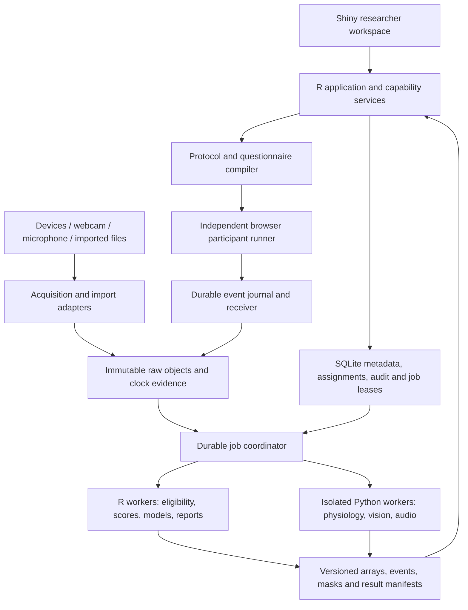

# Brohn master architecture and large-build contract

## Questionnaire, survey flow and dashboards — 1 October 2026

The owner requires Qualtrics-level or better survey flow, automatic analysis and
visualization dashboards. The [refreshed benchmark and QF01–QF08 acceptance queue](research/QUESTIONNAIRE-QUALTRICS-PARITY.md)
extends the existing questionnaire blueprint and its screenshot inventory.
Keep one typed study definition across flow authoring, participant execution,
source-preserving analysis and editable dashboards. General block routes,
bounded repeats, typed variables/piping/carry-forward, analysis assistance and
saved dashboard/filter definitions require explicit integration and acceptance.

The [2 October assigned-questionnaire delivery contract](architecture/ASSIGNED-QUESTIONNAIRE-DELIVERY.md)
specifies QF01's immutable source/presentation bindings, ordered response timing,
durable retry/recovery and current-access requirements. It also records measured
cold-admission and extreme-request latency issues that must be resolved before
activation. Local component qualification does not release this profile.
The [development source snapshot](../development/assigned-questionnaire/README.md)
contains the current transport/storage implementation for inspection. Its
manifest distinguishes separately qualified components from remaining media and
controller joins; it is not registered or a standalone application. Actual browser
recovery/ordered retention (124 checks), all six pool phases, camera 1.0 (45 direct checks) and
assigned PNG resource checks (36) now pass locally.
The warm retained pool read measured 0.34s, but 29.37s cold remains too slow.
The API-only router now has50 passing header/route checks, while new opening and
finish coordinators have independent static review. Real HTTP, lifecycle, original
finalization and downstream analysis remain their own gates. Keep pre-enrolment
welcome access separate from assigned experimental media. Supply the admitted
original revision context at finish; never rebuild design1.2 through a legacy
compiler. Qualify outside-writer replay and original camera support before
promising good concurrency. Preserve the new local successor's distinction
between streamed main replay and aggregate camera history outside the writer.
Server startup must admit the complete receiving schema before any request.
Storage-only observations may commit during network synchronization; this does
not authorize a new questionnaire action. Failed captures retain exact
process-local retry handles and separate unresolved status. Full application
bootstrap and durable draft/context integration still need their own evidence.
Actual researcher resolution of1.2 currently fails at its legacy revision reader;
use an explicit original-source adapter with genuine immutable decisions and
preserve the participant's original evidence. Resolved-run analysis is separate.

The original analysis worker currently rejects protocol1.2 and constructs legacy
revision contexts. Its MaxDiff path also regenerates offered sets, and two task
scorers recompile their assignment tables. Add an explicit historical source and
post-admission scoring path; do not strip new fields, disguise schema versions or
rerun prospective allocation. Existing formulas and evidence remain versioned.
Saved-report export has separate1.2 provenance gates. Durable collection alone
does not close automatic analysis or dashboard acceptance.

The intended advantage is low-click explicit and implicit research in one study:
correct exposure-linked liking, stimuli/controls/versions, gaze/AOIs and other
qualified measurements. Automatic outputs retain denominators, missingness,
uncertainty, method evidence and exact source history. Dashboard filters must not
change saved analyses or invent independent participants. Qualtrics documentation
defines feature expectations; it does not validate Brohn's science or establish
comparative usability. Existing package statuses remain unchanged.

## Eye-tracking designs, controls and stimulus versions — 1 October 2026

Support common consumer eye-tracking designs, including shelf/packaging tests,
search, advertising, digital journeys and physical product use. Control stimuli
and multiple material versions must coexist within one study with explicit
assignment, exact presentation identity, AOI correspondence and appropriate
analysis. The [flexibility requirements and implementation queue](research/EYE-TRACKING-FLEXIBILITY.md)
separate existing multiple-stimulus support from missing variant allocation,
dynamic coordinates and other advanced designs. Add-version authoring is now
implemented with domain/portable, controller and actual researcher acceptance;
its [release scope](qa/STIMULUS-VERSIONS-ACCEPTANCE.md) preserves the current
all-stimulus exposure and condition-pooling rules. Use the ordered EF01–EF12
queue and its [source/depth companion](research/EYE-TRACKING-FLEXIBILITY-SOURCES.md);
no full-family or scientific acceptance follows from this review. Retain the
academic evidence contract and all 50-capability/17-package statuses.

EF02/EF03 implementation separates the complete study from each session's
assigned presentation. Version sets declare all/one selection; explicit arms
declare combinations; ungrouped stimuli can provide shared controls. Preserve
the full design hash, scheduling policy, chosen arm and observed exposure
separately. Validate paired-analysis opportunity in every arm. Before enabling
this profile, connect its compiler, historical reader, clone/portable mapping
and accessible authoring to a participant view containing only assigned material.
Both new and existing resource routes must deny unassigned assets for that
profile. The inactive core does not change current every-stimulus delivery or
establish completed participant/scientific qualification.

## Academic evidence for every method and design option — 30 September 2026

The [1 October option appraisals](methods/evidence-2026-10-01/README.md) now retain
reviewed EDA, EEG spectral/time-frequency, gaze/AOI/pupil, study-control and
multiplicity findings in the repository. Source depth, adaptations, disagreements
and unresolved applicability are explicit. Apply them to option-level guidance
and future evidence snapshots; this document bundle does not activate new
calculations or establish method/device qualification.

The owner requires multiple academic sources and contemporary consumer-science
best practice across **every analytical approach, consequential option and
study-design template**. The [academic evidence contract](methods/ACADEMIC-EVIDENCE-CONTRACT.md)
defines option-level traceability, a versioned method-evidence registry,
independent corroboration, explicit applicability/assumptions, design preflight,
accessible in-app explanations and automatic citation-preserving methods/export.
An overall bibliography or two sources for a broad modality does not qualify all
its options. Evidence gaps and Brohn-specific adaptations remain visible.

Audit existing application/worker options as well as planned methods; retain the
full 50-capability/17-package scope. This requirement does not silently change
saved recipes/results or count component tests as scientific validation. The
registry, option coverage and connected UI/export acceptance are active work;
this section records the requirement, not completed academic qualification.

The [30 September audit](methods/evidence-2026-09-30/README.md) now makes this work
concrete: actual option/default inventory, measurement and design references,
ten remediation topics and five proposed conditional design profiles. Use exact
method/context evidence rather than universal baseline, threshold or sample-size
presets. Cyclic order rotation is not general carryover balancing; software
admission bounds are not scientific recommendations; current detected ECG
intervals remain distinct from qualified NN-HRV. These gaps guide new versioned
recipes and understandable preflight, without rewriting previous studies.

## HRV and skin temperature are required end-to-end paths — 30 September 2026

The owner explicitly requires **HRV and skin temperature across the full
platform**, from study/protocol design and declared acquisition through import,
quality/exclusion review, supported analysis, baseline/event comparison, saved
visualization, complete reports, history and export. This reinforces the existing
`ecg.hrv`, `ppg.prv` and `temperature.peripheral` scope; it adds no completion claim
and does not replace the 50-capability/17-package contract or any package status.
BWP16 remains planned.

The [implementation inventory and next gates](research/HRV-SKIN-TEMPERATURE.md)
distinguish current detected ECG RR/PPG PRV measures and calibrated imported
temperature descriptions from remaining work. ECG detections are not confirmed
normal-to-normal intervals; PPG PRV is a separate measurement. Temperature has
complete gap-aware traces and supported interval descriptions, but endpoint
change is not a physiological baseline contrast. Neither modality supplies a
stress/emotion score. Protocol duration, exclusions, baseline support, sensor
placement, calibration, ambient conditions and settling must remain visible.

The active saved cardiac package candidate preserves existing science; it does
not itself close NN-HRV, nonlinear methods, temperature adapters or physical
device qualification. BWP03/BWP06/BWP09/BWP13/BWP15/BWP17 share the next connected
gates. The inventory records the exact production audit separately from external
candidate progress so that a display/export pass cannot become a broader method
or end-to-end readiness claim.

## Exact-constant EDA accepted boundary — 30 September 2026

Scientific recipe `eda-neurokit-highpass/1.1` is an explicit addition; missing
recipe/default behavior and saved 1.0 results remain unchanged. The new fixed
policy applies only after unit conversion, finite/nonnegative admission,
segmentation and the existing duration/edge eligibility rules, when every
converted value is exactly equal. It preserves the first converted value as
the raw mean. It does not use an epsilon, flatten near-constant data or choose
a physiological response threshold.

That branch is descriptive-only: the nine processed-response features are null,
with exact-constant support explaining unavailable response interpretation.
Processed coordinate columns remain null and numerical candidate rows are empty;
no artificial DC trace is substituted. Response/amplitude denominators stay null
where originally defined. Nonconstant and otherwise ineligible segments retain
their existing numerical or unavailable paths.

Standalone continuous review request/model 1.1 and saved EDA preparation/body/
evidence 0.2 explicitly admit this branch. Every explicitly new EDA package uses
renderer/admission/plan 0.2; old-science-only new packages may do so without new
science. Exact stored 0.1 requests/packages keep their own contracts on reopen.
Selection container 0.3 and existing resource limits remain unchanged. Constant
cells use the whole original segment, have no processed component or marker
panels, and cannot advertise a smaller window as a capacity remedy. Full
coordinate evidence is distinct from complete raw conductance or input bytes.

The [scoped acceptance record](qa/EDA-CONSTANT-SIGNAL-ACCEPTANCE.md) separates
native original-source and joined historical reads, the initial 30-check/six-scan
researcher journey, and ten cold-restart checks with exact old/new downloads.
A genuine literal `-0.0` source retained its original CSV bytes; persisted
scientific mean/preview values were already positive zero, and standalone 1.1
review passed 13 checks against those saved fields. The injected negative-zero
transport diagnostic remains preserved; this path requires no generic or old
1.0 transport change.

The six-source native package missed its existing 300-second deadline. Its
separate direct diagnostic measured 324.02 seconds for rendering alone and
did not publish a package. The isolated performance change reuses completely
validated EDA models only within a single render and rechecks source evidence
size/SHA-256 on every hit; native holds, authority, final publication checks and
all resource bounds remain required. Independent source review and 1,250 old/new
equality comparisons passed. The corrected same six-source native workload now
passed 24 checks: ten new read-only jobs succeeded on attempt 1 with normal
60-second leases and the unchanged 300-second deadline. Mixed/evidence-only
packages took 282.557/237.232 seconds. Independent source oracles passed 171/131
checks over the same 109,863 scientific leaves, 38,232 identity fields and 7,000
constant coordinate rows. Separate cross-variant proof preserves all 49 complete
data/evidence members, six report refs and five EDA preparations; omitted
distribution/paired section companions do not remove original scientific rows.
The generic strict comparison still requires identical scientific and prepared
source sets and therefore correctly refuses that optional-preparation removal.

The direct measurement-table correction passed 36 component and nine actual
phone/desktop browser checks after the visual usability defect. Cold startup
readiness and owned-manager cleanup passed 27 targeted checks; joined03 runtime
then passed 74 supervisor and 22 acquisition checks with all 1,415 source files
unchanged. Final joined03 browser acceptance passed 31 initial and 11 cold
checks: both boots used normal full startup; exact mixed/evidence-only 0.2 and
historical 0.1 HTML/ZIP/HEAD reopened without changing jobs, objects or listed
entities. All owned services closed. This saved-review/offline/cold phase
complements the earlier generation/edit/cancel journey, not a whole-journey rerun.
No whole-platform, physical-device or general detector qualification follows
from this checkpoint.
It advances BWP02/BWP04/BWP06/BWP09/BWP13/BWP15/BWP17 without changing statuses.
Next is the
[saved cardiac contract](architecture/SAVED-CARDIAC-REPORT-NEXT.md). Near-flat
and absolute response criteria, raw bundles, image context, workloads and
restrictions remain open.

## Earlier saved EDA report boundary — 28 September 2026

The [EDA report contract](architecture/SAVED-EDA-REPORT-PACKAGES.md) extends
the existing durable Prepare report lifecycle. Its scoped final researcher,
download and cold-restart flow has passed. The
[phase record](qa/EDA-REPORT-PACKAGE-ACCEPTANCE.md) and
[source receipt](qa/EDA-REPORT-PACKAGE-SOURCE.json) keep component, native worker,
independent export, history, presentation and browser evidence separate.

EDA display preparation is a distinct supervised prerequisite. Queue and catalog
paths read bounded metadata; complete source verification, typed streams,
display reduction and export occur behind the worker boundary. Frozen source
relationships retain required EDA parents, including related-only sources, and
deduplicate the same exact source selected directly and required indirectly.
The new profile does not widen earlier classic/task/choice admission or replace
an old source/preparation with its current head.

The request retains exact decimal continuous-window overrides independently of
figure sections. Original-window metadata permits a cold or refused request to
be edited without inventing a prepared model. Applying a window changes the
draft; preparing that edit creates a new intent and display. Component/page-only
changes reuse the exact preparation. Related-only sources keep original windows
until their exact report is explicitly selected. Zero-figure EDA packages still
retain all required numerical evidence.

Event defaults show phasic conductance and original method windows; continuous
defaults show tonic and phasic conductance. Unavailable cells remain visible.
Each component and candidate-marker page counts toward the figure limit;
numerical table pages are separate and do not silently truncate candidate
overlays. Whole-segment features stay whole-segment features in a focused view.
Complete original analyses and processed rows remain in evidence regardless of
figure/window choices. Complete raw conductance series and input bytes are
excluded, while original bounded raw previews and raw summary fields remain.

Current-reader/source fences, native guards, child lifetime and lease checks
remain necessary at publication and download. Separate source/lease checks and
the normal 60-second-lease researcher flow have passed. The child-lifetime
test uses explicit instrumentation and a declared replacement clock; it is not
proof of arbitrary wall-clock expiry. No decomposition, peak detection, scoring
or new EDA-liking estimator is run to assemble or reopen a report.

Display limits and complete-evidence limits are independent. The actual large
UI source exceeded the 500,000-sample full-view bound; its exact 10–20 second
display succeeded. Assembly still correctly refused 201,416,771 projected bytes
against a 201,326,592-byte budget. The complete 666,734 original rows cannot be
discarded to make a smaller figure fit. This demonstrates honest refusal, not
full large-package recovery; broader capacity remains open.

A known single-source complete-evidence refusal is attached to its exact saved
report ref. The UI explains the limit and original-export path rather than
offering a smaller figure/window or unchanged new version as a remedy. Adding
sources, changing the title or hiding figures does not unlock that known bound.
Removing/replacing the source allows ordinary new preparation, while Resume
checks the original saved intent independently of the edited draft.

Final joined10/UI04 differs from the main journey's joined07/08 application in
only two UI files and one regression test across 1,395 compared files. Backend,
scientific, preparation and export sources remain identical. Its separate
78/36 controller and 24-check/four-scan actual history/guidance checks close the
correction; the main 8/74/9 journey is retained under its original source binding.

This advances BWP02/BWP04/BWP06/BWP09/BWP13/BWP15/BWP17 without closing any
package. At that checkpoint the [constant-signal method remedy](methods/EDA-CONSTANT-SIGNAL-NEXT.md)
was next; the accepted checkpoint above records current progress before the
[separate saved ECG/PPG contract](architecture/SAVED-CARDIAC-REPORT-NEXT.md).
The [retained counterexample](qa/EDA-CONSTANT-SIGNAL-FINDING.md) prevents export
fidelity from being mistaken for detector qualification. Historical 1.0 results
stay exact; no arbitrary threshold is introduced here. Source-open latency,
deep Windows curation paths, tiny-chunk review cost, task/choice image context,
raw bundles, wider workloads and restrictions remain open. The full
50-capability/17-package contract is unchanged.

Dated checkpoint notes below are historical; current implementation priorities
are in [WORKSTREAM](WORKSTREAM.md).

**Earlier choice-report scoped checkpoint, 27 September 2026:** the
[new report contract](architecture/SAVED-CHOICE-REPORT-PACKAGES.md) preserves
complete saved MaxDiff results inside the same durable preparation lifecycle.
An explicit source-admission profile and separate choice-display artifact allow
native, imported and packed cohort choice findings beside tasks, liking and
scales. Every present task/choice component requires exact prepared evidence,
even when its figures are hidden. Old profiles and historical packages remain
strict and unchanged; a newer report head cannot replace a selected source.

Choice preparation audits the saved result and original source binding without
refitting utilities or replaying choice journals. Native task display preparation
retains its separately identified audit boundary. Assembly consumes the frozen
artifacts. Counts/utility sections show saved not-requested or unavailable
states rather than inventing estimates. No choice–liking estimator is added.

The [phase record](qa/CHOICE-REPORT-PACKAGE-ACCEPTANCE.md) records scoped
source/worker/pure/history, final researcher/mobile and unchanged restart
acceptance. Its browser uses existing genuine synthetic reports; original
scientific production is a separate phase. This advances BWP04/BWP10/BWP13/BWP14/
BWP15/BWP17 without closing any package. Task/choice image bytes, raw bundles,
other report families, performance and restrictions remain open. The full
50-capability/17-package architecture remains authoritative.

The [original physiological package plan](architecture/SAVED-PHYSIOLOGICAL-REPORT-NEXT.md)
specified EDA followed by separate ECG/PPG admission. Its EDA follow-on is the
scoped checkpoint above; BWP09 continues to own physiology methods while report,
source and experience packages share integration. Neither profile may invent a
paired estimator or silently admit unsupported mixed parents.

**Earlier task-report checkpoint, 27 September 2026:** the
[saved task-report contract](architecture/SAVED-TASK-REPORT-PACKAGES.md) extends
the existing durable report flow with a separate immutable task-display boundary.
It binds complete native, imported and cohort evidence to original scientific
reports before rendering all seven enabled task profiles beside explicit liking
and scales. No new score, task–liking association or construct claim is added.
Exact preparation identity survives history; package opening never rebuilds
the native journal audit under today's rules.

The final task-report source checkpoint passed the connected researcher workflow, mobile export review, exact download checks and cold restart. This is scoped acceptance, not completion of the platform.
The [acceptance evidence](qa/TASK-REPORT-PACKAGE-ACCEPTANCE.md) separates genuine
source/scoring jobs from display preparation and saved export. The actual
118/100 panel refusal and new-intent recovery to 20 figures preserve every
included numerical collection. This advances BWP04 (liking/scales), BWP10
(task evidence), BWP13 (reports), BWP15 (guided history/recovery) and BWP17
(portable artifacts/qualification), retaining all statuses as implementing.
Task stimulus image bytes/context panels, unsupported mixed families, MaxDiff,
larger workloads and post-collection restrictions remain explicit work.

**Earlier reviewed-clock checkpoint, 27 September 2026:** the
[reviewed-clock workflow](qa/PUBLICATION-REVIEWED-CLOCK-20260927.md) now connects
original event selection, supervised exact previews, named map versions,
complete original-row windows and automatic full-export charts. Original export
readiness is independent of chart preparation. Current reader/source checks,
native read seals and session-bound downloads preserve exact earlier versions
across retry and restart. The tested phone view presents the first complete
signal figure when ready. Read the
[contract](architecture/REVIEWED-CLOCK-ALIGNMENT.md) and
[researcher guide](operations/REVIEW-ALIGNED-RECORDINGS.md) for supported bounds.
Physical synchronization is not established and scientific recipes do not
silently consume the reviewed map.

The [results/history architecture](architecture/RESULTS-AND-SAVED-HISTORY.md)
still governs saved findings and exact views. The
[saved-report package contract](architecture/SAVED-REPORT-PACKAGES.md) now
connects durable preparation, exact historical sources, complete included
numerical collections and portable HTML/ZIP for saved gaze, questionnaire and
paired findings. Its [scoped checkpoint](qa/PUBLICATION-REPORT-HANDOFF-20260927.md)
separates connected acceptance from component and authority evidence. The
[shared saved-download contract](qa/PUBLICATION-SAVED-DOWNLOADS-20260927.md) now
finalizes 19 saved callbacks and hosted 403 after their existing access gates:
exact streamed GET content, identity encoding and decimal HEAD lengths, with
no scientific reruns or global formatting changes. Framework downloadHandlers,
participant/static routes and range/compressed responses remain separate.
The task/liking continuation has the scoped acceptance described above. Later work
expands MaxDiff and other complete report adapters,
source-opening responsiveness and post-collection restrictions.
Post-collection restrictions, broader workloads, wider clock/playback methods
and remaining measurement/device/operation gates stay open. Saved-source opening
still takes several seconds despite scoped responsiveness gains. The complete
50-capability / 17-package scope below remains active and unfinished.

**Explicitly resumed 24 September 2026 after checkpoint `2b3b31a`.** The
[workstream](WORKSTREAM.md) and [current checkpoint](qa/PUBLICATION-SAVED-MEDIA-20260924.md)
record delivered work and ordered continuation. Portable connected verification
and complete facial review now have scoped acceptance;
[declared video/audio mapping](architecture/SAVED-MEDIA-REVIEW.md) passes
its separate gap/export/restart journey. Those configured-core and GNAT
vertical-integration slices were subsequently accepted; see the current workstream. The full scope below is retained; publication does not
establish completion.

**Resumed 20 September 2026:** the owner resumed implementation, keeping the
Brohn name. [Current status](../STATUS.md) and the
[completion backlog](PRODUCT-COMPLETION-BACKLOG.md)
record the latest connected work and its scoped acceptance. [John's handoff](HANDOFF-JOHN.md) preserves the
8 September stopped checkpoint. This plan remains incomplete.

Revision 2026-09-27, retaining the September 8 full-scope contract. **This is the authoritative implementation plan.** It expands the earlier eye/EEG/EDA examples into a holistic platform and incorporates the executable method/tooling preparation. The [50-capability register](preparation/capability-register.json), [scope explanation](preparation/HOLISTIC-CAPABILITIES.md), [build manifest](preparation/build-manifest.json) and [method specifications](methods/reuse/README.md) are its companions. Earlier documents in `docs/planning` retain detailed source research and the 238-ticket archive; conflicting example defaults or sequence labels there do not override this plan.

The destination is a premium, accessible R-first workspace for undergraduate and commercial researchers: design controlled studies, combine implicit/explicit/physiological measures, collect or import once, and receive traceable analysis with minimal intervention. Breadth is part of the architecture from the start. Features become available when their complete study-to-report route works, rather than from the presence of a package or an empty screen.

The [unified experience](product/UNIFIED-EXPERIENCE.md) connects all 50 capabilities through 13 shared measure-card families and [34 planned whole-journey evaluations](product/journey-acceptance.json). The [brand system](brand/BRAND-SYSTEM.md), [editable visual assets](../www/brand/asset-manifest.json) and [design preview](brand/preview.html) define the premium soft-dark direction. The [introduction and launch plan](product/INTRODUCTION-AND-LAUNCH.md) defines onboarding and evidence-appropriate release claims; the [Astra build brief](preparation/ASTRA-BUILD-BRIEF.md) turns this contract into focused implementation packets. These specifications are cross-cutting requirements, not separate products or achieved usability claims.

## 1. Full product surface

**Optional facial-output route, 24 September:** reviewed video datasets now use
one explicit pinned CPU model profile for20 native AU outputs and seven native
expression-category scores. R owns permission/mapping validation and original-
source guards; the isolated worker owns inference using pinned local assets.
Complete frame JSONL/face CSV, exact PTS, selected-window/stride and detection
support survive normal guarded report publication and reopening. Optional setup
persists the interpreter and both required asset directories. The
[connected acceptance](qa/FACIAL-EXPRESSION-ACCEPTANCE.md) and
[runtime acceptance](qa/FACIAL-RUNTIME-ACCEPTANCE.md) distinguish this enabled
route from automatic camera processing, [complete temporal review](qa/FACIAL-REVIEW-ACCEPTANCE.md) and empirical
model/construct qualification. No identity tracking or mental-state inference
is added by displaying the native category labels.

The automatic-capture integration preserves the original named processing
decision, frozen settings, source chunks, assembly and any received withdrawal;
later manual permission remains a separate researcher attestation. Its
[camera analysis contract](architecture/CAMERA-ANALYSIS-CONTRACT.md) and tested
new helpers are connected to the production queue. Its
[joined acceptance](qa/CAMERA-FACIAL-AUTOMATION-ACCEPTANCE.md) covers original
permission, automatic native processing, exact exports, interruption and restart,
with separate independent native agreement on the encoded synthetic camera feed.
[Participant code preservation](architecture/PARTICIPANT-RUNTIME-PRESERVATION.md)
now has connected publication, assignment, routing, browser recovery and backup
checks, plus [researcher provenance review](qa/PARTICIPANT-CODE-PROVENANCE-ACCEPTANCE.md). It pins
generic browser code only for new releases, preserves historical unknowns, and
keeps recovery available
without relaxing study-data or run authorization. Browser assets alone do not
preserve the complete server compiler or scientific execution environment.

**Connected workflow continuation, 24 September 2026:** complete question/scale
distributions and paired-person figures now read verified complete saved evidence
through bounded supervised preparation. R retains item types, scoring-key versions,
condition identities and the original inferential results; figure paging and exact
exports use the same selected source. The one-command local setup prepares the
pinned runtime and checked configuration while preserving earlier configurations
on failure. The [integrated workflow ledger](qa/INTEGRATED-WORKFLOWS-20260924.md)
records connected acceptance. Linked event/signal review now uses two to four
channels from one immutable import with exactly matching declared clock metadata,
a shared cursor/window, explicit gap breaks and complete selected-value exports.
Clock agreement is not measured synchronization accuracy. Session recovery now
records an immutable source-bound researcher decision separately from original
participant and camera receipts. Only an actually received complete ending with
supported source can enter its separate confirmed-completion report; abandoned
or partial records remain distinct. Late new uploads cannot rewrite a resolution,
and unsent browser data remain retained. Closed collection inventories preserve
both original outcomes and researcher decisions through history/backup.
See [the recovery acceptance](qa/SESSION-RESOLUTION-ACCEPTANCE.md).
Audio source waveform/spectrogram and event-EDA baseline/response review now
have scoped connected acceptance. They expose complete original samples and
saved analysis events without rescoring a selected display window. Video audio
derivation is connected through explicit stream selection, a complete
decoder-frame timestamp ledger, immutable parent/consent references and ordinary
channel mapping. Container timestamp precision is not physical synchronization.
The isolated-team hosted profile now has local actual-OIDC acceptance. Each
session HTTP dispatch checks current authority before returning cached data,
files or downloads; a separate timer closes revoked/expired WebSockets.
Enrollment, material access and admitted uploads have distinct expiry policies.
This is one trusted team/default project per workspace, with public operator
deployment and broader sharing/roles still open. Respiration review now exposes
saved normalized waveform, complete cycle phases and exact numerical exports,
including unchanged cycles intersecting a selected view. A view does not trigger
new scientific scoring. Exact saved-answer/session navigation now has connected
acceptance, with received events separate from the assigned protocol and later
researcher resolutions. Derived-audio source authority spans general reports,
original WAV downloads, plots and both ends of interval reuse. Complete EMG
input/clean/RMS and saved-burst review now has connected acceptance. Final
respiration/EMG axes retain distinct labels and exact saved-window identities.
Whole-recording EDA review now has connected source/export/restart acceptance,
with first full numerical verification moved to a supervised process and fresh
source authority retained. This wave does not complete all capabilities.
Dedicated Brohn response-window SC-IAT now has connected source/import/cohort
and restart acceptance, including an independent102-check source/scoring audit; the
optional local facial-output route has the scoped acceptance linked above.
Neither route establishes physical timing or construct validity. New EMG artifacts preserve the unit-converted pre-cleaning
input separately from cleaned voltage and the RMS envelope; historical artifacts
without that input must display its absence rather than reconstruct it.

**Measurement-review integration, 24 September 2026:** saved video reports now
open the complete source-bound frame/metric explorer through the shared report
screen. R owns report/selection authority, supervised workers index complete
observations and extract exact recorded pixels, and the interface keeps native
landmarks, validity states and complete numeric exports distinct from sampled
plots. Landmark paging updates only the value region so disclosure and keyboard
focus survive; image readiness does not replace that region. See the
[current checkpoint](qa/PUBLICATION-CHECKPOINT-20260924.md) for exact processed-value,
pupil/blink, fNIRS and video evidence. Repeated synchronous source-context reads
now use bounded canonical-hash computation reuse while retaining fresh authority
and source checks; [recorded interface timings](qa/SIGNAL-REVIEW-RESPONSIVENESS.md)
cover the exercised ECG report. Closed releases now have a versioned immutable
collection inventory: resolve pending receipts/processing, finalize, reopen saved
reports and clone the exact released design in History. This inventory counts
sessions and retains source identities; it does not decide scientific eligibility
or imply that separately imported recordings are linked. See
[collection acceptance](qa/COLLECTION-HISTORY-JOURNEY.md). These additions preserve the
remaining package, scientific, device and release requirements below.

Implementation resumed at the owner's request on 20 September 2026. Progress and
remaining gates are tracked in [the build log](sprints/02-full-platform.md) and
[researcher QA](qa/RESEARCHER-QA.md); package status is not a scientific claim.
Review uses two complementary layers: independent expected arithmetic and an
automated researcher who authors, serves, completes, imports, reviews and exports
a study through the actual interfaces. Actual human comprehension testing and
physical-device qualification retain their own evidence requirements.

Integration corrections are part of this architecture: participant display names
are separate from explicit repeat-person linkage; imported phase/scoring scope
must be declared; imported answers use the same typed validator as collection;
reports publish in the same fenced transaction as job completion. The BIAT
target-only block prefixes supersede the incorrect attribute-only wording in the
earlier method preparation. Evidence and the primary source are recorded in the
[implicit reference](methods/reuse/IMPLICIT-REUSE.md).

The operational spine is [the complete study lifecycle](product/STUDY-LIFECYCLE.md):
workspace and libraries → create/curate → pilot → publish to participants →
collect/analyse → close/finalize → historical review, archive and reuse.
[Design portability](product/DESIGN-PORTABILITY.md) makes save-as-template,
design-only clone and portable export/import explicit. These are required build
journeys; preserving raw files alone does not implement a research library.

Questionnaire review is an explicit frozen `questionnaire_navigation` policy.
Second-pass compilation preserves original step/option assignment and adds
occurrence identities plus an untimed review. Receiver-derived state controls
Back/Edit, typed dependency invalidation, actual visit timing and explicit sealing
before the next stimulus/task. Browser commands wait for durable acknowledgement;
offline drafts remain local. One effective projection feeds explicit summaries,
scales and downstream synthesis, while source-linked edit history stays separate.
The connected domain/receiver/authoring/browser checks pass; full researcher report
acceptance passes 19 browser checks/five scans with one saved analysis. See [the contract](qa/QUESTIONNAIRE-ANSWER-REVISION-CONTRACT.md)
and [browser evidence](qa/QUESTIONNAIRE-REVISION-BROWSER.md).

Task cohorts now have an explicit source-preserving integration for canonical
imported attempts. Frozen report revisions, original objects/registries, selected
attempt hashes, plan and identity-map hashes define one homogeneous exact method
and evidence level. Review declares people, visits and repeat weighting; missing
identities withhold person summaries, and unavailable attempts remain visible.
Native summary reports need their separate full-journal/registry adapter rather
than inheriting canonical import evidence implicitly. Component checks pass;
saved-worker acceptance has 29 checks/five publications and the browser journey
has 19 checks/five scans. See [task cohorts](methods/IMPLICIT-TASK-COHORT.md).

The connected large-data correction covers both worker input and report output;
scoped acceptance passes 27 worker checks/two publications and ten browser
checks/seven scans with one additional beyond-preview synthesis publication.
Current 16 MiB inline JSON documents are not a whole-run data capacity guarantee.
Use small versioned manifests for pinned original protocols and ordered journal
sidecars; verify original event hashes, counts and final sequence before replay.
Use dedicated typed NDJSON artifacts for complete questionnaire effective records
and edit history, with bounded, labelled previews in the catalog. One combined
artifact per kind spans selected runs; publish via existing staged/fenced object
promotion. Full downloads and source-integrity checks must work after reopening.
Preserve existing inline report bytes and identify the new artifact representation
explicitly. Increasing constants or truncating history is not this correction.
Native worker manifests now bind the exact saved request/run/protocol and original
journal byte hashes. Full typed analysis artifacts feed scientific consumers;
the compact status, quality, counts and display values must agree with that full
analysis at publication and hydration. Saved previews cannot be extracted as
scientific observations. Component evidence and the explicit 512 MiB artifact
profile are in [the artifact contract](operations/QUESTIONNAIRE-EVIDENCE-ARTIFACTS.md).

Historical queries must apply their parent, project and operational state before
result limits. Related report/dataset lists page forty records with exact totals;
study-link and source-report selectors use searchable metadata across the project.
The same rule protects recording reservations: old active acquisitions cannot be
hidden by newer completed history. See [historical retrieval QA](qa/HISTORICAL-RETRIEVAL.md).

Explicit MaxDiff is a separate optional design graph (`design.maxdiff`), with up
to 20 exercises and one untimed, resumable participant step per exact offered set.
It runs after timed tasks and before final questionnaire items. Compiler, receiver,
analysis and portable reuse retain exercise/item/set identities, exact framing,
realized order, source origin and explicit omissions. Aggregate paired utilities
are distinct from implicit scores and person-level inference; conjoint remains
a separate implementation. See [the method contract](methods/MAXDIFF.md).
Mapped best-worst imports pin an exact saved study revision and exercise hash.
Their explicit column mapping preserves people, sessions, offered item order,
complete pairs, partial/missing choices and unpresented sets. A multi-exercise
file retains every original row hash and explicit selection/exclusion reason;
no imported file is treated as browser response-time evidence.

Calibrated temperature and tri-axial acceleration now use named imported-channel
recipes with explicit units, sensor placement, calibration, acquisition filtering
and temperature environment/settling declarations. Full series and optional
protocol-threshold events retain missing spans, source clock strings and support
intervals. Reviewed synthesis matches those exact intervals and source definitions;
fragmented observations of one exposure require a separate pooling recipe. These
features do not implement thermal-image ROIs, EOG, other IMU channels or construct
classification. See [peripheral methods](methods/PERIPHERAL-FEATURES.md).

Versioned participant option assignment binds the design seed, reserved allocation
and immutable question/stimulus identities. New questions default to this policy;
older releases retain their original shared timeline policy, with explicit
draft-only migration and exact replay. Hash-ranked permutations do not guarantee
counterbalancing. See [option assignment](methods/QUESTION-OPTION-ASSIGNMENT.md).
Session review reads the original stored protocol and offers its byte-exact JSON;
the assigned sequence remains distinct from observed presentation/completion.
Dependency-safe questionnaire sections now have a versioned optional design
graph. Fixed positions stay fixed; independently movable groups/sections shuffle
only among their declared eligible positions. Parent/follow-up dependencies and
scale items stay together in fixed internal order. Compiler manifests retain the
exact section/group/question order per assessment and use metadata beside the
question record, preserving existing scale assessment identities. Flat historical
protocols acquire no new fields. The connected section editor validates whole-group
scope/order moves and preserves contained scales; its37 Shiny/CAS checks pass,
including atomic name/target capture after a rapid browser interaction exposed
stale values. The full researcher/participant/reuse journey passes18 assertions,
four scans and two automatic reports; see the
[section contract](methods/QUESTIONNAIRE-SECTIONS.md) and
[browser acceptance](qa/QUESTION-SECTIONS-RESEARCHER-JOURNEY.md). Back
navigation still requires a shared effective-answer/revision contract; it cannot
be enabled by simply decrementing the participant cursor.

RT scoring uses `brohn-task-score/1.1` and `brohn-rt-metric-support/1.0` for
metric-specific support. Mean/median require one retained correct test response;
sample SD requires two. Error rate uses answered scored trials, omission rate all
scored outcomes in a complete task. A partial task score means at least one metric
is supported, not that every RT statistic is available. Historical reports and
non-RT profiles are unchanged. Future imports/cohorts must consume per-metric
eligibility and retain these exact denominators; see
[implicit import/cohort contract](qa/IMPLICIT-IMPORT-COHORT-CONTRACT.md).

The registered task profiles, now including a separately named response-window
SC-IAT, have a source-bound trial-summary importer:
original CSV/TSV, an immutable protocol registry with exact compiled tables, saved
study revision and explicit first/final-response semantics. Pure compatibility
checks113 and native complete-journal/export/reimport checks15 pass. Storage,
worker and researcher UI are connected, with14 mapping Shiny guards; complete
saved-worker/browser acceptance is active. Unknown definitions and incomplete
attempts remain visible without fabricated scores or browser evidence. Dedicated
task-score exports preserve mixed-study results and per-metric eligibility.
Person-aware task cohorts remain a separate explicit plan and identity-crosswalk
implementation; trial rows are not independent people.

Participant session history uses exact study/project SQL filtering before40-row
metadata pages. A limited frozen camera-policy projection supports the table;
opening/downloading a protocol separately verifies its original bytes. Metadata
does not authorize participants or claim protocol hash verification. Catalog33,
Shiny navigation11 and assigned-protocol16 checks pass; larger cohort selection
and other remaining full-run queries still need their own bounds.

| Product area | Required coverage |
|---|---|
| Study design | Within/between/mixed designs; repeated stimuli/sessions; controls, neutral comparators, acclimatization, physiological baselines, practice, checks and rest; randomized/blocked/constrained allocation, counterbalancing and reproducible seeds; image/audio/video/web/interactive stimuli and timed input. |
| Implicit and behavioural tasks | IAT/BIAT/SC-IAT, GNAT, evaluative/semantic priming, AMP, approach/avoidance and trajectories, speeded association, simple/choice RT, attention/interference/inhibition; extension profiles for stop-signal, memory/learning, psychophysics and relational methods. Each procedure has its own score and eligibility. |
| Biovital data | Screen/world gaze, fixations/saccades/AOIs, blinks/pupil; EEG/ERP/spectrum/time-frequency and extension connectivity/frequency tagging; EDA; ECG/PPG/HRV/PRV; breathing; surface/facial/startle EMG; EOG, fNIRS, temperature and device-dependent cardiovascular/movement channels. |
| Camera, voice and behaviour | Webcam capture or imports, face/hand/body geometry, named expression/AU outputs, independently calibrated webcam gaze, movement and UX events; speech activity/acoustics and optional transcripts. rPPG/camera respiration remain distinct supported-profile extensions. |
| Questionnaires and explicit choice | Text/instructions, single/multiple choice, dropdown, ratings/Likert, sliders, semantic differentials, matrix, ranking, numeric/text, media questions and repeated panels; skip/display/branch logic, piped values, blocks/randomization, validation, progress/back-navigation, translations and scale scoring. MaxDiff/conjoint use dedicated designs and models. |
| Analysis and delivery | Automatic normalization/QC/segmentation, AOI proposals and review, event/interval summaries, paired/group/hierarchical inference, missingness and uncertainty, linked liking, synchronized timelines, reproducible HTML/CSV/JSON and later PDF, study templates and batch reprocessing. |
| Research operations | Workspace/projects; searchable studies and datasets; versioned design/asset libraries; cloning and portable design import/export; lab/hosted deployment and participant links; consent, invitations, eligibility, waves and quotas; monitoring/closure; historical reports, reanalysis, archive, sharing and verified restore; role/retention controls and support matrix. |

The register separates **sensor**, **paradigm**, **analysis** and **construct interpretation**. A webcam is a source, an AMP is a procedure, peak amplitude is an outcome, and emotional valence is an interpretation attached to a specified model. The same source can serve several recipes without duplicating recordings. “Core” denotes intended implementation coverage; it is not a claim that every profile is currently enabled.

## 2. Runtime boundaries

```mermaid
flowchart TB
  UI[Shiny researcher workspace] --> APP[R application and capability services]
  APP --> COMP[Protocol and questionnaire compiler]
  COMP --> RUN[Independent browser participant runner]
  RUN --> JOURNAL[Durable event journal and receiver]
  HW[Devices / webcam / microphone / imported files] --> ACQ[Acquisition and import adapters]
  ACQ --> RAW[Immutable raw objects and clock evidence]
  JOURNAL --> RAW
  APP --> DB[SQLite metadata, assignments, audit and job leases]
  RAW --> JOB[Durable job coordinator]
  DB --> JOB
  JOB --> RP[R workers: eligibility, scores, models, reports]
  JOB --> PY[Isolated Python workers: physiology, vision, audio]
  RP --> ART[Versioned arrays, events, masks and result manifests]
  PY --> ART
  ART --> APP
```

R owns protocol semantics, method selection, quality/exclusion policy, statistical models and report interpretation. Shiny/bslib owns the researcher shell. Framework-independent browser modules own interactive authoring and a separately served participant runner. The implemented runner uses original JavaScript and native browser timing/key events; prepared jsPsych packages are not an implied runtime dependency or validation claim. Local native/Python adapters own acquisition; R/Python subprocess workers own bounded jobs. These are process responsibilities, not a requirement to deploy many microservices.

Use SQLite/DBI/RSQLite for local transactions and metadata and immutable filesystem objects for bulk bytes. The connected runtime uses its own durable queue, fencing and `processx` supervisor. Arrow/Parquet and DuckDB remain options for typed derivatives and bounded queries; `targets`/`crew` may be introduced behind the job contract when their integration is justified. Prepared packages are not current runtime dependencies. Keep native EDF/BDF/BrainVision/EEGLAB/SNIRF/XDF/vendor files alongside normalization manifests as their named adapters become enabled. MNE-BIDS is an interchange route, not the application database.

The worker boundary is an allowlisted operation plus immutable JSON request and output-manifest paths, launched through `processx` or an equivalent supervisor. Use explicit executable/environment pins, per-job scratch space, timeout, cancellation and output-size limits. Never load heavy model state into Shiny or let uploaded survey expressions become arbitrary R/JavaScript/Python. A future HTTP transport must preserve the same contract.

Each attempt receives a monotonically advancing fencing token. Publication checks the current lease/token and cancellation state transactionally, validates output hashes, then promotes a temporary manifest atomically. An expired, cancelled or superseded worker cannot publish success after a retry starts. Persist the intent/commit record so restart reconciles an interrupted file promotion; a renamed file alone is not a completed job.

## 3. Shared entities and storage

The next coordinated schema revision must introduce the following without adding unknown fields to current strict 0.1.0 validators. Preserve old draft/report readers and write explicit migrations.

| Entity | Required identity and semantics |
|---|---|
| Workspace / project / membership | Visible storage/deployment profile, ownership and per-action access; source checkout is separate from research storage. |
| Template / asset library revision | Reusable design, questionnaire, recipe and stimulus definitions; content hash, source/licence, authorized membership and pinned revision. |
| Study draft / compiled revision | Revision preconditions, typed task graph, safe questionnaire expression AST, assets, methods, assignment and interruption rules; immutable compiled hash. |
| Deployment / collection window | Pinned protocol/runner/assets, lab or hosted endpoint, access/quota/closure policy, pilot/live origin; enrollment pause, terminal runs, late uploads and frozen cohort are distinct. |
| Enrollment / invitation / wave | Separate contact linkage and pseudonym, versioned consent, eligibility, scoped/expiring access, transactional reservation and repeat/resume policy. |
| Allocation / run / presentation | Transactional assignment and seed, participant/session relationship, origin, station; realized presentation IDs distinct from planned node IDs so repeats/retries cannot merge. |
| Dataset / immutable dataset version | Named catalog entry with raw object membership, import/source provenance, units/dictionary/clock/geometry mapping, permissions and linked studies/analyses; curation never overwrites the original bytes. |
| Stream / channel / segment | Modality, units and scale, native schema, sensor/site/configuration, sample-rate or irregular-time declaration, original clock/domain, source reset identity, missing spans. |
| Event / explicit response | Original event and correction sequence; display/input/change/commit distinction; key correctness, first and final-correct RT; question/options/revision/display order, referent and phase. |
| Raw object / sealed run manifest | Content hash, size/format, source lineage, expected final sequence, required/optional stream set, terminal reason and completeness evidence. A partial run can be sealed without pretending it completed. |
| Quality mask / review decision | Target input hash, channel/time/event scope, reason/policy, automatic or human provenance; corrections and interpolations retained separately. |
| Method / model / provider | Versioned input requirements, effective settings, native output scales, permitted interpretation, engine/code/model hashes, access/licence and resource requirements. |
| Analysis job / artifact / report | Immutable input set, parameter/mask/AOI revisions, attempts/leases, output schema and hashes; valid denominators, missing reasons, uncertainty and cohort definition. |

Store uniform analogue arrays, irregular events, audio sample buffers, video frames/PTS, image geometry and explicit answers as distinct typed objects. Do not force EEG, video or repeated exposures through the prepared-gaze CSV. Use decimal strings for large native ticks in JSON and explicitly checked int64 columns in Parquet. Preserve clock transforms and uncertainty separately from original values. Calibration, viewport/image transforms, per-eye coordinates, camera/world geometry and 3D optode/electrode positions are versioned metadata, not guessed from array magnitudes.

Raw media and contact information need separate storage/access/retention policies. No facial identity recognition is required. A participant withdrawal or data-retention action must account for derivatives, caches and backups; reports retain an explicit provenance/redaction state. Shared/cloud operation adds authenticated roles, project isolation and scoped provider destinations before deployment.

The connected app uses a selected workspace outside the repository, with
`catalog.sqlite`, immutable `objects/` and `manifests/`, bounded staging and
disposable scratch. Its libraries retain study revisions, source datasets and
saved reports. The explicitly retained prototype used `data/drafts` (overridable
by `RESEARCH_PLATFORM_DATA`), embedded PNGs and neighboring report/protocol
folders; it did not retain every draft edit. The implemented legacy importer
preserves the available historical artifacts with migration fingerprints and
source lineage. Protected contact linkage remains a separate operations contract.

Researcher uploads now distinguish a completed browser transfer from a reviewed
import. The final Import action binds the displayed upload, destination study
revision, family, title and origin. A pending ingestion entity owns the real
background job; only a complete, verified source becomes a dataset. Windows
same-volume intake holds the original across the pre-hash interval, then uses
staged publication and one short fenced catalog transaction. Browser disconnect
does not drop the source guard. A restarted original owner cannot silently
authorize an unguarded pre-hash file. See [asynchronous intake](operations/ASYNC-INGESTION.md).

New catalog, report and machine CSV numbers share an exact binary64 transport
policy. Existing raw JSON/hashes remain unchanged and retain strict compatible
request replay. See [numeric transport](operations/NUMERIC-TRANSPORT.md).
Backups bind the catalog and object hashes; executed restore tests check the
restored records and artifacts independently of successful backup creation.
Details and current code evidence are in the
[storage and lifecycle specification](product/STUDY-LIFECYCLE.md).

## 4. Protocol and questionnaire compilation

A template selects a **procedure profile** and **analysis recipe**, then the capability resolver checks that design, stimuli, data channels and execution platform satisfy both. The [protocol catalogue](preparation/PROTOCOL-TEMPLATES.md) supplies further starting profiles; existing [IAT/BIAT/AAT](methods/reuse/IMPLICIT-REUSE.md) and [control-design rules](methods/CONTROL-DESIGN.md) remain method-specific references.

The compiler validates reachable nodes, bounded repeats, balanced cells, category/key mapping, baseline/response windows, warm-up/scored phases, checks, latency requirements, asset preloading and recovery policy. Timings are explicit profile fields, with observed browser/device evidence recorded independently. A control stimulus does not replace a physiological baseline; a keyboard AAT does not silently become a joystick movement task. Fast repeated stimuli trigger the selected overlapping-response analysis rules.

Freeze participant appearance with the protocol: background, luminance, colours, geometry, stimulus motion, timing and baseline conditions are experimental settings. Scope the researcher dark theme separately; neither its preferences nor an operating-system theme or reduced-motion change may silently alter the participant renderer mid-run. A changed participant task requires an explicit accommodation/profile revision and its analysis policy, particularly for pupil and visual-response studies.

The implemented questionnaire uses Brohn's canonical schema and original browser renderer. Prepared SurveyJS packages remain reference tooling, not an installed participant runtime or a promise of feature parity. The accessible authoring interface and R compiler must reject unsupported logic before publication. Test the same truth tables in R and browser: zero/false/empty, unanswered/skipped/not shown/declined, required/conditional items, answer changes, dependent-answer clearing and loops. Keep append-only response history even when a renderer clears its current answer map.

Scale keys, reverse coding, permitted prorating, required item coverage and source/version belong in a scale recipe. Reliability estimates and group comparisons use an explicit sample/design. Questionnaire answers link to the correct run/exposure/stimulus/AOI or session-wide context; motor and cognitive answering periods remain distinguishable from passive stimulus observation.

## 5. Automatic processing and scientific outputs

After a run is sealed or an import accepted, eligibility selects a dependency graph:

`normalize → clock/coordinate mapping → quality → preprocess → events/epochs/AOIs → participant/condition features → declared comparisons → report`.

Each modality has independent masks and success status. Valid liking survives missing gaze; valid EEG survives unavailable facial classification. Cross-modal recipes require explicit temporal support and never infer synchrony from row order. Cache keys include every input, parameter, mask, model and environment revision. A reviewer changing an AOI or exclusion invalidates the affected descendants, preserving prior outputs for comparison.

The [method pack](methods/reuse/README.md) defines detailed outputs for gaze, EEG, EDA, cardiac, respiration, EMG, facial and implicit analysis. Extended neural/fNIRS tools are now prepared in [acquisition tooling](preparation/ACQUISITION-TOOLING.md); newer capability entries still need their named adapter/profile and references to become enabled. Preserve known API constraints, including IAT correction timing, EDA thresholds/recovery, ECG automatic correction and MNE-NIRS wavelength/short-channel selection.

Inferential templates specify participant/trial/stimulus hierarchy, pairing, order, exclusions, missing cells, effect direction, confidence/credible intervals, multiplicity and diagnostics. Repeated samples are not independent people. Support descriptive results, contrasts, mixed models, agreement/reliability and later prespecified fusion/prediction with participant-grouped train/test splits. Universal “engagement,” “stress,” “attention” or “emotion” composites require their own named evidence; retain directly measured features and vendor-native scores.

AOIs share a semantic ID, geometry/time revision, stimulus/coordinate mapping and proposal/reviewer history. Initial automation combines object-box candidates and assisted segmentation with manual correction. Extend to polygon/mask, tracked video and DOM AOIs through the same contract. An 80-class detector does not recognize arbitrary brands, text or requested semantic regions. Add OCR/open-vocabulary/segmentation engines through model manifests and held-out benchmark tasks; record tracking gaps and drift. Detector execution does not establish AOI accuracy.

First-fixation analyses must account for missing gaze within the observation window: missing samples can conceal the first hit. Define a missing-support exclusion or an appropriate censoring model. Right-censoring every apparent nonhit at exposure end is not justified when observation is incomplete.

## 6. Low-click user experience

Home, Studies, Data library and Design library surround the study workspace;
project selection scopes them. Study overview exposes its actual next action,
collection monitor, latest report and history. Search, tags, archived filters,
clone, template save and design import/export are first-class commands. Data
curation and reanalysis can start from the Data library without starting new
participant collection. Keep administration and activity views secondary.

Keep Plan → Questions → Collect → Review → Results. A student chooses a study template, adds stimuli/controls, reviews suggested questions/measures and runs a practice. Preflight supplies concrete fixes for missing inputs. Completed capture starts the agreed analysis automatically. Review focuses on actionable exceptions, with affected-result previews and one correction/rerun action. Results lead with the question, control contrast, usable data and readable interpretation; traces, settings and citations are expandable.

Include autosave, resume, undo, clear progress/error states, templates, bulk import, batch participant processing and inherited defaults. Preserve keyboard alternatives, visible focus, scalable text/reflow, descriptive labels, reduced motion and text/table alternatives to plots. A visual flow editor also has an ordered editable list. Optional channels add capability without multiplying required screens. Measure clicks, completion time, comprehension and error recovery with undergraduate tasks; those are acceptance measurements, not assumed outcomes.

The advanced workspace exposes protocol graphs, acquisition diagnostics, synchronized signal/media review, model/parameter inspection and reproducibility. It shares the same commands and records with guided mode. No separate advanced data model or hidden scientific defaults.

Collect must serve a released study as well as operate a lab station. A hosted
profile publishes a pinned runner and narrow participant APIs behind HTTPS,
authentication/access enforcement and tested storage; it never exposes Shiny
administration or assumes loopback is remotely accessible. Include consent,
eligibility, optional media choice, atomic quota reservation, calibration/practice,
durable receipts, approved resume and distinct exit/debrief routes. Invitations,
QR/link creation and actual outbound messaging are separate actions. Closing
recruitment, resolving active runs, finalizing a cohort/report and archiving are
distinct; a restored archive or backup must not reopen recruitment automatically.

Clone and portable `.brohn-study.zip` import produce new draft identities and
fresh allocation/deployment state, with source lineage and permitted design
assets. They omit participant/contact records, observations and results. Dataset
reuse/reanalysis has its own command. Unsupported dependencies remain visible;
import validates in isolation and never executes uploaded code or auto-publishes.
The [portability contract](product/DESIGN-PORTABILITY.md) defines bounded archive
handling, schema migration and independent semantic roundtrip acceptance.

Implement the shared cards, one readiness summary and one synchronized timeline in the [unified experience specification](product/UNIFIED-EXPERIENCE.md). The [34-scenario acceptance registry](product/journey-acceptance.json) covers controlled gaze-plus-liking, broader multimodal collection, implicit blocks, survey logic, partial streams, correction/recovery and accessible operation. Its click/time/comprehension targets remain unmeasured until observed. Apply the [brand tokens and 32 original icons](brand/BRAND-SYSTEM.md) to actual empty, populated, processing, failure and recovery states; the static preview's contrast and scanner checks do not substitute for testing those application journeys.

## 7. Large build execution and completion

### Implementation corrections from researcher QA

- A dataset retains its declared collection origin separately from its import
  transport. A pilot recording imported from a device can therefore be linked
  to pilot browser responses without relabelling either as live. Mapping can
  pin a historical design revision; following the current draft is an explicit
  alternative that freezes that revision when each analysis is queued.
- Multimodal synthesis uses reviewed source-person/session mappings. Equal
  labels, timestamps or file order never establish a link. Each measure keeps
  its own denominator; a missing EEG record does not delete valid gaze or liking
  observations. Declared comparisons use equal-person paired differences and a
  recorded Holm family. Source report versions and output objects remain pinned.
- Post-collection AOI work requires a narrow compatibility rule: researchers
  may explicitly combine different full design hashes only when the projection
  excluding AOIs and administrative description/lineage is identical. Execution,
  timing, materials, conditions, questions and scoring still must match. Gaze
  outcome definitions include their complete AOI geometry; different definitions
  of one outcome cannot silently pool. Exact design matching remains the default.
- XDF and explicit stream bundles normalize into a retained stream catalog,
  not a scientific report. Typed samples, original order/timestamps, clock
  correction evidence, units and source identity boundaries remain available as
  complete hashed artifacts. Clock alignment and scientific mapping are separate
  explicit operations; preservation never claims synchronization or calibration.
- Immutable objects stay read-only in storage. Downloads use a separately
  writable, hash-verified transfer copy because Windows HTTP serving otherwise
  rejected the inherited read-only flag. The original source is unchanged.
- A fresh visitor to a closed or paused participant link receives that status
  before consent. Pending idempotent starts and saved sessions retain their
  existing recovery rules. Archive/restore never reopens recruitment.
- Study forms carry their study/stage identity. Autosave ignores stale inputs
  from a previous form during rapid navigation, preventing cross-study edits.
  Polled progress panels retain their readable opacity while refreshing.
- Main study tasks contain their frozen nested procedure. Instruction, onset,
  key, correction, interruption and completion evidence shares one browser clock
  segment. The receiver replays this sequence; submitted scores are never the
  scoring authority. Reloading an active timed procedure preserves partial
  observations and ends it as interrupted.
- Prepared gaze intervals and raw gaze samples are separate import choices.
  Sampled angular detection requires measured rendered-stimulus geometry and
  documented thresholds; active-response phases, gaps and absent pupils do not
  become passive gaze or zero values. The current fixed detector produces
  candidates, with its qualification status retained in reports.
- Video uses decoded presentation timestamps and preserves full observations as
  hashed artifacts. Native geometry/blendshapes do not automatically become
  emotion, calibrated gaze or attention measures. AOI masks are suggestions;
  accepting an explicitly reviewed rectangle creates a new study revision and
  keeps the original mask, source hash and decision history.
- Scientific children record the hashes of loaded R and selected Python sources
  before execution and verify they stayed unchanged afterward. Changed source
  code during execution causes an actionable retry instead of a misleading
  provenance record. Results and full artifacts publish under the same job fence.
- A shared page accepts content through `...` and requires named `actions`.
  Researcher QA found that positional content otherwise became a toolbar item,
  breaking the Data, Settings and Activity layouts. Modal titles have explicit
  accessible names and consistent heading levels.
- Templates and portable designs now preserve all five registered implicit/RT
  procedures and task images, remap their identities and retain procedure hashes.
  A separate declarative analysis-plan record now preserves selected numeric
  questionnaire/AOI outcomes, condition comparisons, rationale and the testing
  family through clone/template/ZIP reuse. Participant reports execute their
  frozen plan; imported sources cannot claim the plan preceded collection.
  Partial-family reports use conservative Bonferroni bounds, identified separately
  from full-family Holm correction. Unregistered recipes still require their own
  validators and workers; reuse must not discard their settings.
- Native channel headers are inspected asynchronously. Exact names, source
  units, calibration ranges, sample rates and annotations inform a researcher-
  confirmed mapping. The EEG worker independently checks calibration evidence,
  including when a manual mapping bypasses the header UI. Numeric single-choice
  codes retain category distributions and do not automatically become means.
- Event-related EDA filters each continuous person/session/recording segment
  before extracting explicitly declared event/baseline/response windows. Short
  condition labels do not divide the filtering context. Missing support, edge
  effects, overlapping/nuisance events and recovery limits remain measure-specific
  reasons for unavailable attribution; decomposition does not solve attribution
  automatically.
- Processed physiological series and event candidates have complete typed
  artifacts separate from bounded display previews. Verification checks source
  and parameter provenance, types, table/row counts and completion before fenced
  publication. Raw observations remain in their original immutable source.
- A derived signal-view entity pins the scientific report and complete typed
  artifact. Catalog/preview jobs inspect full source support, retain extrema,
  separate time/frequency/event axes and do not join unsupported gaps or independent
  clocks. Accessible vector plots have exact numerical support and separate
  full-artifact/view downloads. Changing a plot window does not rerun a recipe.
- Questionnaire display logic is authored as a typed all/any/not tree with an
  explicit save/cancel boundary. Browser and R receivers use exact numeric equality
  and preserve number, text and boolean distinctions in collection membership.
- The local launcher monitors owned child exits and restarts them with bounded
  retry delays and separate diagnostic logs. Existing compatible external services
  remain externally owned. Process liveness does not establish device readiness,
  responsiveness or uninterrupted acquisition.
- Webcam recording is a frozen design policy with separate participant agreement,
  explicit audio/retention settings and observed browser clock bounds. IndexedDB
  retains unacknowledged chunks; retries cannot append different bytes to the same
  sequence. The receiver preserves a single recorder container, original bytes,
  full callback/decoded-frame evidence and a portable policy/study manifest.
  Partial or declined capture is distinct from completed recording. Optional local
  face geometry runs only after the recording and study satisfy their gates.
  Preview-track clocks do not establish encoded-frame alignment or emotion validity.
  Cancelling setup invalidates pending permission requests: late-granted tracks
  are stopped before attachment. Decline retries and reload recovery retain one
  immutable decision and never synthesize a recording finish.
- Local LSL acquisition has an independent manager and durable command queue.
  Metadata discovery does not initiate recording. Reviewed source identity, units,
  declared origin and participant/session linkage precede acquisition. The whole
  original recording archive remains immutable when a researcher prepares a
  secondary interchange dataset. Source clocks and reset segments remain distinct;
  clock fusion and downstream scientific mapping need explicit contracts.
- Stream curation produces one derived numerical dataset for an explicitly
  selected analogue stream. A `segment_column` keeps clock resets, removed spans
  and source continuity boundaries separate inside that dataset. It does not
  create new people, sessions or exposures. Physiology and event-related analysis
  retain those segment identities; inference continues to use declared people
  and sessions. Full curation decisions and native source clocks remain separate
  artifacts alongside the original stream. Unknown units require an explicit
  documented declaration; nonidentity scaling needs a calibrated conversion.
  Researchers can keep automatic standard channel analysis enabled after
  reviewing its effective recipe. The derived CSV, every source-row decision,
  complete curation manifest and original source are independently downloadable.
  The [stream curation contract](methods/STREAM-CURATION.md) fixes those boundaries.
- [Questionnaire scales](methods/QUESTIONNAIRE-SCALES.md) save source/version,
  quantitative item bounds, reverse keys, coverage/prorating and optional linear
  conversion with the design. Collected assessments use their frozen stimulus
  occurrence; imported assessments need explicit shared identities. A question
  step ID is not the identity of the whole questionnaire occasion. Missing IDs
  retain item summaries with an explicit scale-scoring gap. Keys survive cloning
  and portable designs with remapped references; exports retain every score and
  item-level evidence. Invalid unsaved item edits can be explicitly discarded
  before the researcher revises a protected scale key.
  After-stimulus scale scores can enter the saved control-comparison family with
  individual-item and gaze outcomes. Eligible assessment means remain within
  session; repeat-visit differences remain within person. Unknown person linkage,
  unsupported pairs and missing scores cannot become extra participants or zeros.
  Scoring keys and source receipts are pinned; clone/import remap the hypothesis
  to its new scale identity. Whole-study scales need another explicit design
  before any condition or longitudinal hypothesis can apply.
- [Neural plots](methods/NEURAL-PLOTS.md) read the complete saved ERP, Morlet and
  frequency-tagging arrays, selecting one recording/condition/channel at a time.
  They retain exact frequency/time grids, trial support, units and baseline
  settings. Plot windows are explicitly bounded; complete CSV/JSON downloads
  include every retained sample and Morlet frequency. Displaying a curve does
  not introduce another averaging, interpolation or inferential calculation.
- Setup uses one pinned R dependency closure across the researcher and its child
  services. A readiness check distinguishes core availability from optional
  scientific profiles, model hashes and codec availability. Startup does not
  install packages, download models, discover devices or start a recording.
  Windows report publication requires a source/ABI-bound native R guard and a
  bounded standard-library Python probe. Missing dependencies fail before a
  workspace is opened or an analysis job is claimed; optional scientific package
  profiles remain separate from this required operational helper.
  The [repeatable check runner](qa/RUNNING-CHECKS.md) executes selected isolated
  checks with independent logs and a machine-readable result. Researcher browser
  journeys and physical qualification remain separately named evidence scopes.
  Supervised tool deadlines are expressed in the called API's units: seconds
  for `processx::run`, milliseconds for process waits and SQLite busy timeouts.
  Timeouts must stop owned descendants and leave a failed operation without a
  false completion receipt. A stalled-helper integration check exercises this
  boundary; successful startup checks alone cannot establish failure recovery.
- Collection presents the route actually configured for each measure. A measure
  checkbox declares research intent; it does not enable a camera, device or task.
  The summary distinguishes participant questions/tasks/camera policy from
  separate recording/import and profiles still awaiting implementation.
- Participant launch uses the same domain validator closure as study authoring;
  a frozen design must compile at enrollment in the actual separate service.
  Offline reports serialize both HTML head and body so metadata, responsive
  styles and escaped content survive download. Whole-file report QA includes
  narrow-screen use, not only the in-app view.
- Publication contention is measured with concurrent participant receipts.
  Transient SQLite writer locks return retryable 503 while the browser retains
  the exact operation. Bulk copying, hashing and row validation must move out
  of the final fenced metadata transaction; the staged-byte correction and
  failure invariants are tracked in [publication transactions](operations/PUBLICATION-TRANSACTIONS.md).
  A helper's live-process check alone cannot seal files through SQL commit: the
  parent publisher must retain its own read-only handles that deny mutation and
  replacement until that commit finishes. The Windows native implementation is
  exercised across generic, camera, multistream, curation and derived-result
  publishers after independent QA identified the helper-death race. Large source
  intake and manager-owned acquisition preservation remain separate paths.
- Catalog scalars and protocol/report JSON use matching 17-digit numeric
  serialization. Method-oracle tolerances never excuse changes caused by
  transport. Legacy stored JSON/hashes stay untouched; replay can compare exact
  retained values under a separate bounded comparison allowance, while new
  writes retain their existing size limits. A value rounded away by an earlier
  writer cannot be reconstructed or treated as the same new request.

These are implemented software contracts with the scoped evidence in
[researcher QA](qa/RESEARCHER-QA.md). Whole-platform acceptance remains active;
successful fixture or browser execution is not human or physical-device evidence.

The [build manifest](preparation/build-manifest.json) maps **every capability** to an owning work package, dependencies, acceptance evidence and a lifecycle status. A single orchestrated coding run may execute those packages in sequence/parallel and retain checkpoints; the plan does not imply that physical rigs, paid credentials or human evaluations materialize during that run.

1. Stabilize migration, identity, timing/geometry, raw manifests and response contracts.
2. Implement transactional storage, allocation, run lifecycle, event ACK/retry and durable jobs.
3. Complete the participant runner and questionnaire compiler/executor, then the first eye-plus-liking journey.
4. Integrate the broader physiology, implicit, camera/audio and analysis packs against the shared contracts. Independent workers can own separate modules after the integration fixture is fixed.
5. Exercise every enabled pack from authoring/import to report; handle cancellation, restarts, malformed input and missing channels.
6. Add advanced packs through the same interfaces; qualify named live routes and prepare install/backup/release packaging.

This build's done definition is working vertical journeys and reproducible outputs. Keep a machine-readable record of planned/implementing/implemented/verified/externally-blocked packages, with the exact blocker and evidence. An unavailable SDK blocks its adapter, not unrelated processing. Do not silently mark an advanced capability complete because a generic chart or plugin slot exists.

Current execution evidence is in [researcher QA](qa/RESEARCHER-QA.md), the [active sprint](sprints/02-full-platform.md) and the named module tests. The [readiness index](preparation/LARGE-BUILD-READINESS.md) retains the preparation record; package installation alone does not establish product integration. The established destination is `Bransolo1/Brohn` on GitHub with the MIT licence. Record each source checkpoint separately from its actual publication commit; preserve reviewable local changes until the qualified checkpoint is pushed.

Use the [Astra brief](preparation/ASTRA-BUILD-BRIEF.md) to establish shared fixtures, bounded agent ownership and reviewable checkpoints. BWP15 owns the unified accessible experience and brand integration; BWP17 owns the [introduction and launch deliverables](product/INTRODUCTION-AND-LAUNCH.md), including an honestly labelled sample, first-study guidance, demonstrations and a release support matrix. Public claims must follow the enabled journey and named-device evidence recorded for that release.
