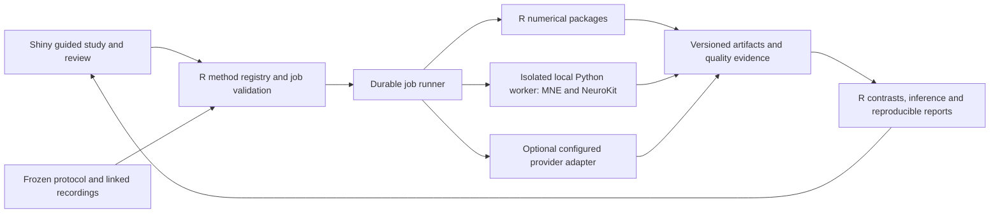

# Brohn method reuse and implementation register

**Scope extension:** this register documents the first reference packs, not a
definitive list of Brohn measures. The [holistic capability register](../../preparation/capability-register.json)
and [master architecture](../../MASTER-ARCHITECTURE.md) cover 50 capabilities across
28 families. [Large-build readiness](../../preparation/LARGE-BUILD-READINESS.md)
adds 101 reference assertions, acquisition/fNIRS/statistics/survey and media tools;
all product integration status remains explicit.

Prepared 2026-09-08 in response to the request to reuse established methods and prepare standard automated analysis. **Use existing scientific engines; make Brohn responsible for correct configuration, data linkage, quality decisions and comprehensible reports.** Most suitable APIs are callable local R/Python functions, so routine analysis does not need a paid cloud service.

## What is ready

An isolated Python environment now contains MNE 1.12.1, NeuroKit2 0.2.13 and CVXOPT 1.3.2, with 38 exact package versions recorded. Separate R research libraries contain saccades 0.2-1, IATscores 0.2.8 and implicitMeasures 1.0.0. The working Shiny application's dependencies were not changed. Five executable benchmarks record **81 passing assertions** with different evidence types; these are not 81 validated product features.

| Analysis family | Reuse route and specification | Current evidence / next integration |
|---|---|---|
| Eye tracking | [Fixations, saccades, AOI dwell/visits/TTFF, transitions, heatmaps, blinks and pupil](GAZE-REUSE.md). R detector references; explicit Tobii/other import contracts. | 20 assertions on the pinned saccades example/settings and segmentation behavior. Next: valid-sample adapter, independent annotated detector comparison, AOI geometry/time fixtures. |
| EDA | [Tonic/SCL, phasic, SCR peaks/amplitudes/latencies/recovery, area, baseline/event/interval summaries](EDA-ANALYSIS.md). NeuroKit; optional cvxEDA; PsPM reference route. | Public-example regression and synthetic deconvolution pass. Next: calibrated units, quality masks, event windows/overlap, parameters that actually reach the algorithm. |
| EEG | [Import/reference, filters/ICA, epochs/ERP, PSD/band power, ERSP/ITC, later connectivity](EEG-ANALYSIS.md). MNE worker. | Known-frequency/variance and epoch-baseline/ERP arithmetic pass. Next: native-file/event fixture and artifact pipeline; no universal engagement/workload score. |
| ECG / HRV | [Rate, MeanNN/SDNN/RMSSD/pNN50, frequency-domain HRV](OTHER-PHYSIOLOGY.md). NeuroKit. | Independent interval arithmetic plus ECG execution smoke. Next: labelled beat/correction reference and duration-specific recipes. |
| PPG / respiration / EMG | [Pulse/PRV, breathing cycles/rate/amplitude, surface/facial/startle EMG](OTHER-PHYSIOLOGY.md). NeuroKit stages and named protocol definitions. | Respiration execution smoke; PPG/EMG not benchmarked. Next: labelled events, calibration and normalization. |
| RT / IAT / BIAT / AAT | [Scoring, error correction, exclusions, control/order and device semantics](IMPLICIT-REUSE.md). IATscores preferred D1 reference; AATtools candidate; explicit BIAT recipe. | 29 assertions; two R implementations match 162 bundled IAT scores exactly. Hand cases test direction/errors/boundaries. Next: QC adapter and final-correct latency event contract. |
| Webcam / facial signals | [MediaPipe geometry, Py-Feat candidate; Affectiva or FaceReader adapters](FACIAL-PROVIDERS.md). Preserve native output definitions. | 8 original offline contract assertions; later [media references](../../preparation/MEDIA-TOOLING.md) add installed models and synthetic inference. No camera/API capture or product adapter is enabled. Next: exact-output replay, quality/timestamp mapping and interpretation-specific evidence. |
| Explicit responses | Existing liking contracts; [questionnaire plan](../../planning/QUESTIONNAIRE-BUILDER.md). R declarative scoring, browser execution. | Rich survey/scale engine remains planned. Next: stable items/options/revisions, branches, missing reasons and exposure linkage; published scale key/reference examples for each licensed scale. |
| Advanced measures | [EOG, rPPG and fNIRS pointers](OTHER-PHYSIOLOGY.md); later dynamic AOIs, fixation-related EEG and multimodal inference. | Later [acquisition references](../../preparation/ACQUISITION-TOOLING.md) exercise synthetic SNIRF, fNIRS and coherence routes; production recipes remain planned. rPPG is a separate algorithm/reference problem; installing NeuroKit does not supply working webcam pulse analysis. |

## What the checks establish

| Executable reference | Passing assertions | Interpretation |
|---|---:|---|
| Physiology / EEG | 18 | Independent spectral/ERP/HRV arithmetic; EDA upstream-example regression; ECG/RSP execution smoke. |
| cvxEDA | 6 | Synthetic model-compatible recovery; pinned effective parameters and wrapper behavior. |
| Gaze | 20 | Upstream reproduction, explicit settings, source hashes and segmentation observations; no independently labelled fixation accuracy. |
| Implicit scoring | 29 | Hand arithmetic and upstream score replay, including tests that reproduce known package failures. 162-score agreement is a reference comparison inside this count. |
| Facial contract | 8 | Published numeric/time example and synthetic boundary shapes/missing states; no model inference or complete SDK parser. |

Results, scripts, exact environments and rerun commands are indexed in [scripts/benchmarks/README.md](../../../scripts/benchmarks/README.md). External sample rows, SDKs and model weights stay outside this repository. All current results are reference artifacts, with production disabled or an explicit reference-only status. The existing app's 773-check suite is a separate earlier checkpoint and was not rerun for these isolated research additions.

## Architecture to implement

This is the target worker architecture, not an already operational service. R remains the scientific/domain authority; it can delegate numerical operations to tested libraries. The browser handles participant timing and input; device sidecars own acquisition. Neither a long Python calculation nor hardware recording belongs in a Shiny request.

The first worker experiment should use a subprocess with a bounded JSON manifest and file artifacts, explicit environment/version checks, timeout/cancellation and an allowlist of operations. Benchmark this seam before selecting the final worker transport. Do not embed arbitrary uploaded scripts or expose Python execution through the UI. Cloud facial providers are optional, explicitly configured destinations; local models should also have immutable model/configuration identities.

## Proposed method and result contract

Extend the existing [contract plan](../../CONTRACTS.md); do not silently add these fields to current 0.1.0 records. A named method manifest must include:

- Recipe ID/revision/status, engine/package/model version and code/artifact hash; supported measurement and interpretation.
- Required streams/channels, units/scaling, sensor/site, sample-rate support, clock transform/uncertainty, recording segment and protocol/exposure/phase identities.
- Event/window/baseline definitions, control/contrast direction, practice/error/nonresponse rules and required support.
- Every effective processing parameter: filters/reference, thresholds/decomposition, interpolation, normalization, scoring order and seeds. Record library defaults explicitly; reject unsupported options.
- Quality-mask revision, original/retained counts and durations, exclusions and manual decisions. Corrected/imputed data retain provenance.
- Raw/configuration hashes, environment manifest, input/output schema revisions, job identity and completion state.

Each measure returns value/unit, numerator/denominator where applicable, valid support, missing/exclusion reason, analysis unit and applicable uncertainty. Save intermediate arrays/events, recipe and report as separate hashed artifacts. A failed modality produces its own unavailable outputs without discarding valid liking or other modalities. Joining modalities requires shared exposure and event timing, not approximate row order.

Cache keys include inputs, protocol, recipe, parameters, masks and environment. Changing an AOI, baseline, exclusion or scale key invalidates affected derivatives and retains the old result. Retries must not duplicate observations or overwrite a different completed artifact. Reports show measured outcomes separately from interpretations, and preserve native vendor scores when their scales differ.

## Low-click automation and end-to-end statistics

After import/collection finalization, Brohn should check eligibility, run the selected template's preprocessing and summaries, calculate prespecified contrasts, and produce a report automatically. The main screen shows the research question, usable data and control comparison. Only an actionable quality or configuration exception asks for intervention; method settings and trace plots are available on demand.

Templates declare the observational unit: typically participant-level paired contrasts or hierarchical participant/trial/stimulus models. They retain randomization/order, missing cells, uncertainty and multiplicity choices. Do not treat thousands of frames as thousands of people, search every channel/window for a convenient result, or substitute correlation for causal evidence. Multimodal plots can align signals without claiming a validated combined emotion/attention index.

For questionnaires, separate source item/scale revisions, reverse coding, skipped/not-shown/missing answers, permitted prorating and minimum item coverage. Score only the published version and response anchors used. Add independent keyed examples, branching/repeated-exposure fixtures and item-level audit exports. Reliability and construct interpretation are separate from adding item values; no automatic universal preference or diagnostic cutoff.

## Concrete adoption decisions

1. **Keep known scientific methods intact.** Reuse their published support, and check Brohn's units, event linkage, settings and output agreement. A new device, population, task alteration or inferred construct needs evidence for that particular extension, not a wholesale repeat of the original science.
2. **Use explicit adapters.** IATscores needs an external fast-task/completeness screen; implicitMeasures exposed exclusion/diagnostic and D4-order differences. jsPsych's IAT primitive retains first-response RT and needs correction-event capture for D1/BIAT. NeuroKit cvxEDA ignores custom kwargs. Gaze defaults and whole-record versus trial segmentation differ. These findings are preserved in executable probes.
3. **Keep evidence dimensions separate.** Record published-method support, numerical/reference agreement, Brohn integration checks and named-device/participant scope independently. Passing reference checks enables implementation; it does not pretend the future UI or physical rig was tested.
4. **Select compatible dependencies.** MNE and NeuroKit have permissive core licences; several optional algorithms/R packages have GPL-family terms. Choose the project/distribution licence before release. Provider SDK entitlement, model-weight terms and sample-data permissions are separate from core code licences. No paid account or deployment was created.

## Next build sequence and acceptance

Continue the [six-wave roadmap](../../ROADMAP.md); the 238-ticket planning archive stays intact.

1. **Wave 1:** freeze protocol-bound recording, quality-mask, method-manifest and job-result contracts. One cross-language fixture covers units, clock reset/gap, repeated exposures, controls and unavailable values.
2. **Waves 2–3:** finish runner/response linkage and durable jobs; deliver the complete eye-study recipe with a specified importer, linked liking, reviewed AOIs and a report that reproduces from its manifest.
3. **Wave 4:** wrap the prepared EEG/EDA and implicit references, then other physiology and one facial route. Each pack gets import-to-report fixtures, declared tolerances, interruption/cancellation checks and a clear supported-data profile. Start EEG native-file and labelled gaze/beat benchmarks while shared contracts are built.
4. **Waves 5–6:** measure the named live rig and timing; extend advanced AOIs/inference/models on separate evidence. Test undergraduate completion, comprehension and accessibility through each wave.

No new algorithm research blocks standard-library integration. Remaining work is concrete: build the shared worker/job seam, implement the named recipes and masks, test vendor inputs, and expose their results in the guided Brohn workflow.
