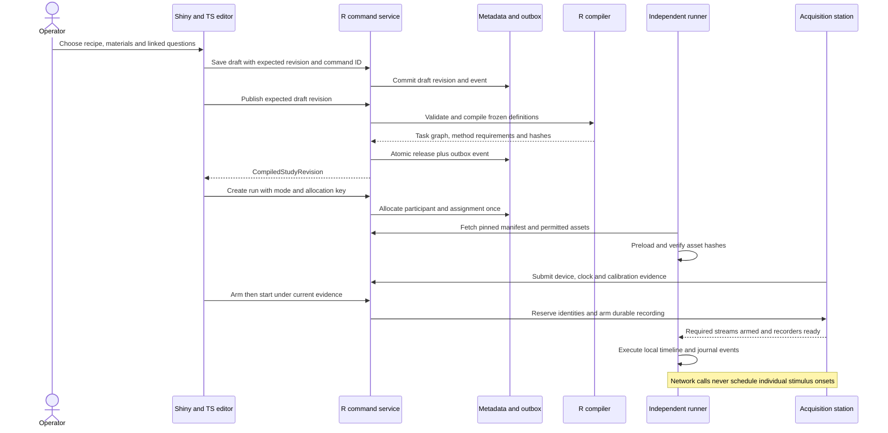
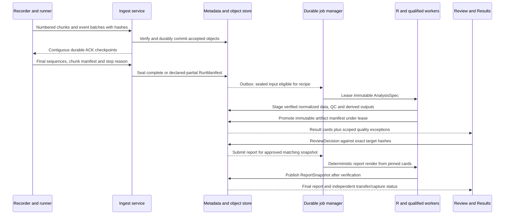

# R application contract: authoring, acquisition, analysis and evidence

**Planning archive:** [MASTER-ARCHITECTURE.md](../MASTER-ARCHITECTURE.md) now takes
precedence over conflicting boundaries, identifiers or sequence below. These
proposed examples remain background; the [build manifest](../preparation/build-manifest.json)
owns current planned work and [STATUS.md](../../STATUS.md) records implemented behavior.

Proposed architecture revision for the strategic plan, 5 September 2026. This document resolves planning ambiguities; it does not describe implemented software, measured performance or validated scientific methods. It supplements the baseline R architecture and responds to review gaps ARC-G01–ARC-G08 and BIO-G01–BIO-G11. All identifiers, hashes and payloads below are illustrative. The companion `implicit-specialist-review.md` supplies the behavioural method contracts (including distinct paper-anchored and vendor-import BIAT profiles); `biovital-team-review.md` supplies physiological method-card and qualification details.

## 1. Concrete runtime boundaries

Retain an R-first modular application. Use Shiny, bslib and golem for the researcher shell, framework-independent TypeScript packages for interactive controls and the participant runner, a local acquisition supervisor for hardware, and separate R/Python workers for scientific computation. The services below are process responsibilities; they need not become independently operated microservices.

| Component | Owns | Cannot own |
|---|---|---|
| `implicitapp` Shiny modules | Guided Plan → Questions → Collect → Review → Results; keyboard alternatives; forms; bounded query rendering; navigation and dirty-state indicators | Authoritative participant allocation, durable job lifecycle, recording buffers, trial timing, or raw data writes |
| `web/components` TypeScript | AOI canvas and object table; survey flow graph; local undo stack; synchronized signal/media viewport; screen-reader text equivalents | Its own scientific parameter defaults, final approval flags or persistence rules |
| `services/api` Plumber + R domain services | Commands, ACLs, revision preconditions, specification validation, transactions, result queries, audit/outbox, upload authorization | Arbitrary uploaded R/JS execution; CPU-heavy analysis inside request handlers |
| `implicitcore` R package | Pure domain validators, recipe/method registry checks, compiler rules, typed objects, state transition policy | Shiny session dependencies or device SDK globals |
| `web/runner` independently served TypeScript | Preloaded study execution, response/event logging, safe questionnaire AST interpretation, IndexedDB journal, local presentation and recovery policy | A dependency on Shiny round trips for stimulus onset or response acceptance |
| `services/acquisition` native/Python supervisor | Station lease, device identity/configuration, capture-ready barrier, sample spool, clock observations, markers, health, bounded recovery | Deciding scientific exclusions or silently changing the protocol after a failure |
| `workers/r` | Import/normalization, quality rules, method-specific signal/AOI analyses, contrasts, deterministic narrative and report data | Live acquisition priority; mutable shared scientific state across jobs |
| `workers/vision` / qualified EEG bridge | Versioned model/algorithm inference over frame or signal references; explicit input/output contracts | Unnamed emotion truth, changing an acquisition timestamp to inference completion, or a shared interpreter inside Shiny |
| Object store + metadata service | Immutable bytes and manifests; relational authority for revisions, job leases, policies and grants | A single unversioned “current results” file |

Shiny's `ExtendedTask` helps an application remain responsive when slow work is actually delegated. It does not supply this durable job/recording protocol. Use it for appropriate short background interactions; submit durable analysis through the API and recover status after the Shiny session disappears. [Posit documentation](https://shiny.posit.co/r/articles/improve/nonblocking/)

A later React shell may reuse `web/components`, the runner and these commands unchanged. Lock this seam with shared JSON Schema/OpenAPI contract fixtures and generated TypeScript types; R validators remain independently tested against the same fixtures. Keep application CSS tokens and keyboard interactions outside scientific packages.

## 2. Objects, authority and immutability

The database is authoritative for control-plane state. Raw objects, large canonical tables and derivatives are content-addressed files; relational records point to their manifests. Local desktop mode uses one service-managed SQLite database and a filesystem object store. Shared mode uses PostgreSQL and compatible object storage. Do not share a SQLite database over a network filesystem or give every Shiny process its own competing authoritative store.

| Object | Required references and meaning | Mutation policy |
|---|---|---|
| `StudyDraft` | Recipe, assignment design, assets, questionnaire, AOI semantic plan, measure/analysis plan; saved revision and draft owner | Optimistic-concurrency revisions. Local unsaved edits are visibly separate. |
| `CompiledStudyRevision` | Frozen draft hash, compiled task graph, questionnaire AST, source maps, assets, method registry snapshot, allocation rules, device requirements, interruption policy, compiler/environment versions | Immutable. Publishing again creates a new revision. |
| `ParticipantAllocation` | Pseudonymous participant ID, study revision, assignment/counterbalance, allocation seed/algorithm, mode, repeated-session relationship | Allocated transactionally once per idempotent request. Clinical/identity records, if any, remain separate. |
| `RunSession` | Compiled study revision, allocation ID, mode (`sample`, `preview`, `pilot`, `live`), station/browser context, required and optional streams | State transitions and appended events; immutable protocol reference. |
| `PreflightEvidence` | Run, device/browser/configuration fingerprints, calibration/validation records, clock evidence, storage estimate, permissions, method eligibility, expiration triggers | New evidence supersedes prior records; previous evidence remains auditable. |
| `StreamDescriptor` / `StreamSegment` | Physical device/serial/plugin, channels/units, actual source settings, timestamp domain, source restart identity, segment boundaries, declared gaps | Descriptor revision at configuration change; never splice source resets into one continuous segment. |
| `RunManifest` | Pinned required stream set, ordered object hashes, expected final sequences, event ledger, clock mappings, stopping reason, completeness evidence | Immutable sealed snapshot, including a partial-data snapshot when capture failed. |
| `AnalysisSpec` / `AnalysisRun` | Run manifest set, recipe/method/parameter registry, AOI revision set, QC/decision policy, cohort rules, environment and seed | Analysis input immutable; jobs and attempts have separate mutable lifecycle records. |
| `AOIRevision` / `ReviewDecision` | Semantic AOI ID, stimulus revision, coordinate/time geometry, rationale, author/model; decision target artifact hash and policy revision | New revisions/decisions append history. Approval cannot float to a changed target. |
| `ResultCardManifest` | Output definition, estimand/unit, denominator, exclusion counts, uncertainty, method/input references, status and narrative tokens | Immutable output of a pinned analysis. |
| `ReportSnapshot` / `ShareGrant` | Card set, report template, evidence/QC/approval snapshot; separately scoped access grant | Report immutable. Access can expire/revoke without rewriting the scientific snapshot. |

Store original imports separately from normalized tables. An importer correction produces a new normalization manifest. Hashes alone do not identify scientific equivalence: recipe, schema and algorithm versions participate in artifact identity. Database migrations must preserve historical revision IDs and prove that previous exports remain interpretable. Back up metadata and object inventories together; restoring only one does not restore a study.

## 3. Authoring and publish contract

Both guided and advanced editors issue the same commands. Choosing an extra measure creates a `MeasurePlan` change and recalculates prerequisites; a checked box cannot remain a cosmetic client flag. A change from the flagship paired A/B two-image design to multiple items or independent groups invalidates recipe eligibility and assignment/analysis previews. Existing reports remain visibly attached to their original study revision.

Recommended endpoints, extending the baseline:

| Command/query | Server commitment and response |
|---|---|
| `PUT /v1/studies/{id}/draft` | `If-Match` revision; validate patch, commit new saved revision plus event; 409 on conflict with field-level differences |
| `POST /v1/studies/{id}/compile-checks` | Typed issues by object path, severity, affected recipe and corrective action; no publication side effect |
| `POST /v1/studies/{id}/releases` | Atomic publication only when every referenced asset is sealed and compilation passes; returns immutable revision and manifest hash |
| `POST /v1/study-revisions/{id}/runs` | Idempotent participant allocation plus run creation; mode mandatory; preview/sample cannot enter the live cohort |
| `POST /v1/runs/{id}/preflights` | Versioned evidence collection; returns ready/blocked/degraded capabilities by method, not a universal green light |
| `POST /v1/runs/{id}/arm` | Validate current evidence fingerprints, reserve station and required stream identities, create recording lease |
| `POST /v1/runs/{id}/start` | Accept once under lease; acknowledge command receipt separately from observed execution start |
| `GET /v1/runs/{id}/status` | Separate participant progress, capture, transfer, processing and review axes |

The compiler validates graph reachability, bounded loops, randomization constraints, missing-value semantics, permitted question types, response validation and branches. It resolves all embedded-data names against a typed namespaced dictionary and emits an immutable safe expression AST. JavaScript `eval`, R `parse/eval` and SQL fragments are not survey-language features. Content sanitization is separate from scientific validation. Each survey compiler release has matching R/TypeScript truth-table fixtures for null, skipped, unanswered, withdrawn and numeric/string comparison cases.

Question events include question and option IDs, question revision, displayed order, exposure/trial/stimulus/epoch context and interaction phase. Preserve first display, first input, edits, validation failure and final commit as distinguishable events where the method requires them. A changed answer appends an event, not an overwrite of the original event. Survey motor/cognitive periods are tagged separately from passive stimulus/baseline intervals. A participant can still skip or withdraw according to the published protocol; missing is not silently scored as neutral.

```json
{
  "command_id": "cmd-71",
  "expected_draft_revision": 17,
  "recipe_ref": "paired-static-image-liking/1.0.0",
  "design": {"unit": "participant", "assignment": "within_participant", "stimuli_per_condition": 1},
  "measure_plan": [
    {"measure_id": "label-gaze-share", "method_ref": "aoi-valid-gaze-time-share/1.0.0", "primary": true},
    {"measure_id": "liking", "question_ref": "q-like/rev-3", "phase": "active_response"}
  ],
  "aoi_semantics_ref": "aoi-plan-4",
  "interruption_policy_ref": "block-boundary-resume/1.0.0"
}
```

In one SQL transaction, publication checks the expected draft revision, inserts the compiled revision, stores the command result and appends an outbox event. The object store is not part of the SQL transaction: referenced blobs must already be uploaded, hash-verified and sealed. Unreferenced staged objects expire under a separately audited garbage-collection policy. No release can reference a client-only or partially uploaded asset.



## 4. Acquisition, clocks and recovery

Use separate state axes. Combining “finished” into one boolean would allow an undergraduate to remove a recording station while bytes are still unverified.

| Axis | Proposed transitions | Invariant |
|---|---|---|
| Run execution | `created → preparing → ready → armed → running → stopping → ended`; failures can enter `interrupted` or `aborted` | `ended` means participant execution ended, not that every required byte exists centrally. Resume policy determines a new segment or new session. |
| Capture | `unarmed → armed → recording → sealing → complete | partial | failed` | `complete` requires every required recorder's final-sequence/chunk evidence. |
| Transfer | `local_only → pending → transferring → verified`; can be `blocked` | Local and remote durable ACKs remain separate. |
| Analysis | `not_eligible → eligible → queued → processing → available | failed` | Eligibility is per recipe/output over sealed inputs. |
| Review/publication | `not_ready → provisional → needs_review → approved → published` | Only an approved matching snapshot can be published as final; policy-approved clean cases can pass automatically. |

Use a **capture-ready barrier**, not an assertion that network start commands happen simultaneously. Before the first scientific stimulus, all required streams have matched stable identities, opened writable buffers, stored descriptors and reported armed status. The runner then logs its local observed presentation events. Where a device cannot arm independently, start it first and retain pre-roll. If a required source fails, a frozen policy chooses safe-boundary pause, abort or continuation with a declared partial modality; no silent substitution of a webcam for a lab tracker or keyboard for joystick.

For LSL, identify a source using adapter/device identity, host/source identifiers and the observed instance, not its friendly stream name. LabRecorder documents ambiguity when same-name streams originate on the same host; its required-stream configuration is a useful acquisition precedent, not proof that a generic LSL stream is qualified. [LabRecorder documentation](https://github.com/labstreaminglayer/App-LabRecorder)

Each station maintains a single active recording lease and one supervisor journal. A GUI disconnect never releases the lease or stops acquisition. Stop requests are idempotent; timeout means an unknown outcome until status reconciliation, not permission to issue a second destructive start/stop sequence. Reattachment reads the station journal and current lease before offering recovery.

The clock service stores raw source times, monotonic domain IDs, mapping anchors, mapping algorithm/version, offset/drift/uncertainty and segment boundaries. Distinguish source sample time, host arrival, scheduled stimulus time, browser-observed presentation, measured physical onset, response-device event and inference completion. A mapped time never replaces the original. Software clock agreement does not remove device/display/input pipeline delays. Physical metrology is separately attached to the supported rig/profile. LSL explicitly separates device/application delays from synchronization; its documentation does not confer a universal latency bound on every stream. [LSL time synchronization](https://labstreaminglayer.readthedocs.io/info/time_synchronization.html)

Calibration evidence is scoped to participant, sensor placement, device/firmware/configuration, coordinate transform, viewport/camera conditions and method. Refit, restart, monitor/viewport change, camera change, material drift or a failed validation can invalidate readiness. Reuse policies must name permitted changes and evidence age; elapsed-time expiry alone is insufficient. Eye/webcam independent target validation differs from model fitting accuracy. “Ready” displays only the capabilities that the current evidence supports.

### Event and upload protocol

Every event contains `(run_id, source_id, segment_id, sequence)` as its stable ordering/idempotency identity. Source sequence establishes local order; timestamps cannot safely resolve duplicate delivery or cross-source causality. Cross-source events carry explicit causal/trigger IDs where known. Unknown physical onset remains unknown.

```json
{
  "schema": "research-event/1.0",
  "run_id": "run-82",
  "source_id": "runner-a",
  "segment_id": "seg-1",
  "sequence": 141,
  "event_type": "question.response_committed",
  "source_time": {"domain_id": "browser-perf-19", "value": 12345.67, "unit": "ms"},
  "trial_id": "trial-12",
  "exposure_id": "exposure-12",
  "stimulus_revision_id": "stim-B/rev-2",
  "question_revision_id": "q-like/rev-3",
  "response": {"option_id": "like-6", "value_type": "ordinal", "value": 6},
  "phase": "active_response",
  "clock_mapping_ref": "clock-map-5",
  "payload_hash": "sha256:illustrative"
}
```

The runner journals locally in IndexedDB and uploads bounded numbered batches. The receiver verifies schema/hash and durably commits before ACKing the highest contiguous sequence plus any accepted ranges. Retries with matching hashes deduplicate; conflicting content for an existing sequence is quarantined. A separate finalization command supplies expected terminal sequences and object counts. A missing chunk is a visible incomplete transfer, not an empty valid recording. IndexedDB is transactional structured browser storage; browser quotas/eviction and actual persistence guarantees must be tested for supported environments. Do not advertise that browser storage survives every power loss or user clearing data. [IndexedDB documentation](https://developer.mozilla.org/en-US/docs/Web/API/IndexedDB_API)

Acquire high-volume hardware streams directly into the station spool. Browser webcam modes store only the permitted local raw/derived representation. Preflight estimates quota and disk requirements; monitor remaining capacity. Reduce optional previews/inference throughput before recording fidelity. If storage fails, stop or pause at the declared safe boundary and seal recoverable data as partial. No in-memory queue can guarantee unlimited offline capture.

After a network outage, upload resumes from ACK ranges without replaying stimuli. A browser reload or camera restart creates a recovery event and new segment; timed-trial resume is prohibited unless that recipe has a qualified boundary policy. The next participant receives fresh assignment/runtime state and calibration context. Sample mode uses deterministic fixtures and never requests camera/device permissions.

### Webcam-specific boundary

The participant page captures permitted camera frames and passes a bounded transferable representation to a dedicated worker; worker output is keyed to frame identity/source timestamp. Optional GPU/vision throughput cannot block the trial scheduler. Dropped processing frames have explicit gaps even if camera delivery continued. Browser video callbacks expose media/presentation metadata, with additional fields available in some contexts; they are not a universal hardware exposure timestamp. Unknown capture time is stored with its limitation. [Video frame callback documentation](https://developer.mozilla.org/en-US/docs/Web/API/HTMLVideoElement/requestVideoFrameCallback)

Keep `geometry.landmark`, native `blendshape`, estimated `action_unit`, estimated `head_pose`, blink events, calibrated gaze, expression-model annotations and explicit emotion answers as distinct schema families. The model registry records code and weight hashes, preprocessing and permitted license/runtime profile. If raw video is not retained, the report states that later re-extraction cannot be reproduced from the retained derived data. A new model generates a new derivative, not a relabelled old stream.

## 5. Processing, QC and reports

An immutable `AnalysisSpec` resolves the method registry at submission time. It includes eligible run manifests, requested outputs, exact algorithms/parameters, masks, decision snapshot, AOI revisions, uncertainty/missingness policy, units, seeds and software/model locks. The automatic recipe selects these before outcome inspection; novices do not choose a filter or a p-value method at report time.

Each method registry entry supplies a declarative input contract, qualification profile reference, unit/estimand/denominator definition, numerical implementation, independent fixture references, failure policy and deterministic narrative template. Status progresses `experimental → fixture_checked → rig_qualified → use_case_qualified`; a label cannot advance merely because a job completed. A webcam dwell recipe and a dedicated-tracker fixation recipe have separate eligibility even if they draw similar result cards.

Standardise the flagship proposed primary as `aoi-valid-gaze-time-share/1.0.0`: eligible valid gaze duration within the predeclared label AOI divided by eligible valid gaze duration in the declared exposure window. The result stores percentage, numerator/denominator seconds, coverage, interval integration/gap rule and missingness; the paired B minus A estimate is in percentage points, with positive values indicating greater gaze share for B and A as the reference condition. Fixation count/duration are separately named secondary endpoints. This planning choice still requires hand-calculated fixtures and dedicated/webcam profile qualification. It cannot become fixation dwell by changing its display label.

Jobs use `queued → leased → running → succeeded | failed | cancelled`, plus bounded retry-wait. Separate `job_id`, `attempt_id`, immutable `analysis_spec_id` and output artifact key. Workers heartbeat leases; retryable failures are classified. At-least-once attempts may repeat computation, but promotion is idempotent under a uniqueness constraint over the artifact key and verified manifest. Expired workers cannot promote after a newer lease wins. Partial files stay staged; cancellation never promotes them.

Quality is a structured result, not a success/failure exception. Store each finding's scope (stream/channel/time/trial/participant/output), rule/version, observed evidence, severity, default action and permitted override. Distinguish: measured nonresponse, valid zero, missing observation, invalid quality, structurally not collected and method unsupported. Review dispositions (`accept`, `exclude`, `correct`, `defer`, `waive`) are separate from raw findings. A waiver documents a limitation; it cannot turn missing units or failed method prerequisites into a scientifically eligible result.

An analysis can produce eye and questionnaire results while EEG is unavailable. Joint associations use their own eligible matched observations and report the overlap count. Analysis units are participants or specified participant/item structures; sample rows are not independent respondents. Invalid/non-observed AOI epochs do not become zero dwell. No fixation within valid exposure produces an appropriate no-event/censor record, not a fabricated time-to-first-fixation at the end of the trial.



Final report publication requires complete evidence for its stated scope, matching nonstale artifacts, necessary decisions and a pinned template. A partial-study report can be final for explicitly restricted outputs; it must state the missing modalities and exclusions. A provisional preview cannot be passed off as the final requested full-modality study. Clean trusted fixtures and qualified policy-approved data flow automatically through Review with no mandatory configuration or audit clicks. Any optional LLM wording is a separate editorial artifact; calculations and standard narrative remain deterministic and traceable to result IDs.

## 6. AOI edits and invalidation

Separate semantic AOI identity from geometry. Before capture, the study declares object/category membership and primary outcomes. Content-based geometry may be defined in advance; later corrections must follow the outcome-blind policy when used for confirmatory results. Automatic proposals, manual corrections and qualified policy approvals all record provenance. Anonymous “confidence > threshold” is not sufficient approval evidence.

The AOI editor maintains local drafts and undo. Saving with an expected parent revision produces an immutable `AOIRevision`; acceptance creates a separate decision targeted at that exact revision. The API computes an impact manifest listing affected stimuli/intervals, gaze-membership artifacts, derived metrics, contrasts and reports. Nothing merely changes a global `approved=true` flag.

```mermaid
sequenceDiagram
    actor Reviewer
    participant UI as AOI canvas and object table
    participant API as R domain API
    participant Store as Revision and dependency store
    participant Jobs as Job manager
    participant R as AOI and analysis workers
    Reviewer->>UI: Correct geometry using permitted review view
    UI->>API: Preview impact with expected AOI revision
    API-->>UI: Affected inputs, outputs and report approvals
    Reviewer->>UI: Save correction and reason
    UI->>API: Save AOIRevision under concurrency precondition
    API->>Store: Append revision and invalidate current descendants
    Store-->>Jobs: Outbox: recompute affected dependency branch
    Jobs->>R: New AnalysisSpec pinned to new AOI set
    R->>Store: Publish new mapping, metrics and contrasts
    Store-->>UI: New cards available; former report historical
    UI->>API: Approve required new evidence snapshot
    API->>Store: Create new ReportSnapshot when ready
    Note over Store,R: Concurrent older jobs retain their own history and cannot replace current cards
```

An old report remains retrievable as a historical frozen analysis. The current-results pointer only advances if the new artifact's complete dependency set matches the active analysis revision. Undo creates a new revision referencing the restored geometry; it does not erase the intervening history. Recompute only affected descendants, but changes to cohort eligibility or a shared contrast can invalidate aggregate results beyond one stimulus.

## 7. UI actions mapped to backend truth

| Visible action/state | Source of truth and event | Worker/query consequence |
|---|---|---|
| Choose recipe/design in Plan | Saved StudyDraft revision; `study.draft_saved` | Recompile eligibility, assignments, required measures and report preview; clear incompatible current-result bindings |
| Add liking/affect or branch in Questions | Question revision and typed flow in StudyDraft | R/TS compiler parity, response schema and phase-tag changes |
| Start sample | Sample-mode RunSession pinned to fixture manifest | No hardware permission; deterministic local pipeline and no live participant count |
| Collect readiness | Current PreflightEvidence with fingerprints | Device/clock/calibration/storage check; unsupported capability carries a concrete reason/action |
| Record / next participant | RunSession lease plus fresh ParticipantAllocation | Required stream barrier, fresh buffers, participant-specific calibration reset |
| “Recording saved” | Sealed local RunManifest | Distinct “uploaded and verified” state; no false reassurance from participant completion alone |
| Resolve exception | ReviewDecision against finding and artifact hash | Scoped recomputation or excluded-output reevaluation; never raw data mutation |
| Approve/correct AOI | AOIRevision and ReviewDecision | Impact graph, invalidation and recompute; keyboard table and canvas read the same revision |
| View Results | ResultCardManifest matching AnalysisSpec | Bounded card query, provenance/denominator text, provisional/final distinctions |
| Export/share report | ReportSnapshot plus export scope / ShareGrant | Reproducible render or byte-identical existing artifact; access independent of analysis changes |

Instrument activations with workflow/mode/object revision so action budgets measure real work. Preserve the agreed targets: sample at most five activations, zero scientific configuration decisions and ten minutes; prepared real study at most four substantive design decisions and twelve activations including file chooser; next participant at most four software activations; zero required report configuration. Physical setup/consent and exceptional repairs are timed separately. Hiding required decisions or treating a silently failed control as “one click” cannot satisfy these targets.

## 8. Deployment, query and plugin contracts

**Desktop/lab station:** an installer starts the local API/metadata service, researcher UI, runner and acquisition supervisor with versioned environments. SDK prerequisites and supported OS/device combinations remain explicit. Drivers or permissions requiring privileges are not silently granted. Local capture can continue offline; optional synchronization is separately queued.

**Shared server:** the R UI/API and jobs run behind authenticated HTTPS with PostgreSQL/object storage; local stations pair through a short-lived enrolment flow and use scoped authenticated outbound control/sync connections. A cloud server cannot directly discover a USB sensor attached to a remote participant. Remote webcam-only runs use a separately qualified browser profile without claiming full lab-rig equivalence. Plumber's documentation identifies network/TLS and resource/input concerns; application authentication and authorization must be designed rather than inferred from having an R endpoint. [Plumber security](https://www.rplumber.io/articles/security.html)

Stage minimum local access controls, recording authentication and backup/restore evidence before G5. Advanced shared-server roles and operations may remain G6 as in backlog B178/B181/B182; a future shared topology must not be mistaken for a launch implementation. Apply core plugin protocol/version checks from G0/G3 even though the public community extension SDK is staged G6. ECG/PPG/HRV and EMG already have later G7 packs (B195/B196). Add a separately qualified respiration pack at G7 and preserve typed source support without making these additions implicit G5 requirements. HRV derives from a named beat/interval source and its correction/duration profile; generic voltage and arbitrary PPG intervals cannot silently acquire that label.

Shiny reconnect reconstructs UI from durable server objects; unsaved local edits offer conflict recovery. No process depends on a user's session memory to keep jobs or recorders alive. A bounded event feed uses cursors and authorization; lost feed messages cause a status refresh, not missed state transitions. Preview queries require stream/time/channel/resolution limits and cache immutable multiresolution tiles. Raw-resolution exports are jobs, not giant Shiny JSON messages. Each worker opens its own database connection; processes do not share live DB handles.

Plugin handshake declares process-protocol version, accepted schemas, plugin build, scientific method/model version, environment lock, OS/device capability, licensing profile, resource budget and permitted data/network access. Major protocol/schema incompatibility blocks startup before data collection. New algorithms never silently replace the version pinned by an existing study. Test compatible minor versions against shared fixtures and retain upgrade adapters only for explicitly supported historical schemas.

Device plugins receive only their station configuration and spool destination. Analysis/CV jobs receive scoped read references and a staging directory; they cannot enumerate unrelated projects. Normal questionnaire/study definitions carry no executable extension code. Trusted researcher code is a separately marked advanced execution profile with isolation, reproducibility and disclosure. Static HTML/question media must be sanitized; filesystem paths, uploads and SQL are validated independently of JSON Schema. Redact identifiers and participant responses from routine logs.

## 9. Failure semantics and executable acceptance plan

| Injected condition | Required behavior / test oracle |
|---|---|
| Save/publish reply lost after commit | Same command key retrieves same revision; conflicting payload under key rejected; no duplicate participant assignment |
| Missing/corrupt asset during publication | No executable release; issue names asset; staged uploads remain resumable |
| Two same-name LSL sources | Ambiguous source blocks required-stream matching until stable identity selected; friendly label never determines eligibility |
| One required recorder fails to arm | No scientific stimulus starts under full-rig mode; operator sees scoped recovery and existing partial data is retained |
| Runner/Shiny/network disappears | Acquisition persists according to policy; journal reconciliation resumes transfer; already presented trials are never replayed silently |
| Source clock reset / USB or camera restart | New source segment, changed fingerprints and explicit gap; calibration/method readiness reevaluated |
| Storage quota or disk becomes full | Warning and safe-boundary policy before buffer exhaustion where possible; partial manifest and exact gap evidence if failure occurs |
| Process dies before/after job promotion | Lease recovery; at most one promoted artifact per key; staged fragments never look successful |
| AOI changed while old job renders report | Old report remains historical; cannot appear as current or inherit new approval |
| Quality rule yields no usable trials | Explicit unavailable output with counts/reasons; no zero effect, empty plot or fabricated confidence interval |
| EEG fails but eye/liking are usable | Qualified eye/liking cards remain available; joint output reports its own eligibility and sample count |
| Algorithm/model/recipe changes | New registry revision and derivative lineage; previously published result remains reproducible |
| Browser/OS/driver update | Supported-profile qualification invalidated or routed through compatibility evidence; no inherited physical timing claim |

Before G1, implement schema/compile truth-table fixtures, transaction/idempotency tests and a crashable station/runner simulator. Before G2, prove independent reproduction through immutable reports, mode isolation, scoped QC and AOI invalidation, plus genuine novice action/comprehension measurements. Before G3, qualify required-stream barrier, storage/disconnect/restart recovery and physical timing on the full reference rig. Before G4, lock exact eye/EEG/EDA/BIAT/AAT/questionnaire/webcam method cards and held-out validation tolerances before inspecting final validation results. G5 publication requires clean-machine restore/reproduction and published capability limitations. Full IAT remains the separately staged G6 method pack unless scope and capacity are explicitly revised; remove the conflicting G2 full-IAT phrase from the baseline plan.

Use engineering target budgets as hypotheses to benchmark, not measured claims: bounded interactive query and draft-save response within the product's agreed responsiveness budget on the declared reference dataset; no recording loss caused by maximum supported preview/worker load; all induced missing chunks/clock resets detected; every final result traceable to source/recipe/decision hashes. Set numerical latency, spatial-error, retained-data and analytic-agreement tolerances separately per named use case in G0 method cards. A generic “95% accurate” target cannot qualify this platform.
