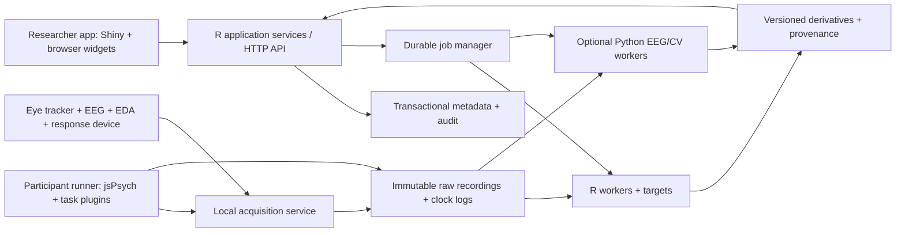

# R-first implementation architecture and engineering release gates

**Planning archive:** [MASTER-ARCHITECTURE.md](../MASTER-ARCHITECTURE.md) now takes
precedence over this document and its archived contract, identifiers and gates.
Use [large-build readiness](../preparation/LARGE-BUILD-READINESS.md) for prepared
tools and [STATUS.md](../../STATUS.md) for implemented behavior. Historical statements
below about no software or tooling describe the original September 5 planning review.

**Version 0.2 clarification:** [The application contract](ARCHITECTURE-CONTRACT.md) is the authoritative elaboration of runtime boundaries, revisions, publication, preflight, recording, recovery and report state. [The biovital review](BIOVITAL-TEAM-REVIEW.md) specifies metric and signal-analysis gaps; [the implicit-methods review](IMPLICIT-METHODS-REVIEW.md) specifies protocol/scorer contracts. Endpoint names in the application contract take precedence over illustrative endpoints in review worksheets. These remain planned interfaces.

The flagship eye outcome is `aoi-valid-time-share/1.0.0`: valid gaze duration in the predeclared AOI divided by eligible valid gaze duration during the declared passive-viewing window. Persist the duration construction, gap rule, validity mask, AOI overlap rule and aggregation method. Report condition differences in percentage points. Fixation duration/count and TTFF are separately named secondary outcomes; TTFF includes a declared censoring policy for non-lookers. This proposed recipe needs reviewed fixtures and qualification before release.

Gate alignment: G2 implements BIAT and the named AAT route; G3 connects the physical AAT input; G4 qualifies the methods. Full IAT remains C:G6 (B189). Minimum local access control and backup/restore are launch requirements; expanded shared/cloud roles and operations remain C:G6. Respiration joins ECG/PPG/HRV and EMG as later G7 qualified packs.

Research and recommendations prepared 5 September 2026. This is a proposed implementation plan, not a claim that software, hardware integrations or benchmarks already exist. Code and JSON below define proposed contracts and are illustrative; no application has been built or executed. Primary-source facts are explicitly cited; architectural choices, performance budgets and acceptance thresholds are recommendations to test.

Packaged companions: `UX-AND-ROADMAP.md` for delivery and interface detail; `QUESTIONNAIRE-BUILDER.md` for questionnaire requirements; `WEBCAM-EMOTION-ATTENTION.md` for camera-based methods; `IMPLEMENTATION-BACKLOG.csv` for candidate work items; and `evidence/manifest.json` for visual-evidence provenance. This document is packaged as `R-ARCHITECTURE.md`.

## 1. Architecture decision

Build an R-first scientific platform with a modular R application, a browser interaction layer and an independent local acquisition service. The commercial launch must combine eye tracking, EEG, EDA and behavioural response data in one study and one reproducible analysis. Reaction-time tasks, physical push/pull tasks and an explicitly specified brief/abbreviated IAT belong in that launch scope. An import-and-analysis prototype is an intermediate milestone; it does not meet the integrated launch definition.

Long-term capability includes webcam-based gaze, facial/action/head-pose/blink observations and qualified emotion/attention research. Webcam is an explicit device/source family, not a synonym for dedicated eye tracking. The companion `WEBCAM-EMOTION-ATTENTION.md` specification supplies the detailed method research; the contracts below preserve these sources and their qualification boundaries within the same platform.

**Primary interaction goal, updated from user steering:** an undergraduate psychology student should understand the next step and complete a first eye-tracking study with very few software decisions. The default application is therefore a guided research workflow with qualified recipes and automatic analysis. The holistic multimodal platform remains the product scope, and commercial consumer/UX studies remain an important application. Capability breadth must not turn the student's first study into a device-management or statistical-parameter exercise.

Recommended boundaries:

1. **R owns scientific meaning:** study specifications, import normalization, quality rules, signal recipes, AOI metrics, implicit-task scoring, statistical models, provenance and reports. These functions remain usable from R without the graphical application.
2. **Shiny owns the initial researcher application:** project navigation, study setup, preparation, live-monitor orchestration, analysis review and report configuration. Use `bslib` design tokens and packaged modules; use `golem` for application packaging conventions. Write business logic in domain packages, never inside reactive observers.
3. **TypeScript owns demanding browser interaction:** AOI geometry editing, synchronized media/timeline navigation, signal canvases, keyboard shortcuts, local undo/redo and the participant task runner. Shiny can host custom JavaScript inputs; that integration is a supported capability, not a workaround. [Shiny custom inputs](https://shiny.posit.co/r/articles/build/building-inputs/), [bslib dashboards](https://rstudio.github.io/bslib/articles/dashboards/), [golem deployment](https://thinkr-open.github.io/golem/articles/c-deploy.html)
4. **A native/Python sidecar owns acquisition:** vendor SDKs, LSL, sample buffering, device reconnects, hardware triggers and local recording. Keep this separate from the researcher web session. A browser refresh or R analysis crash must not stop recording.
5. **Independent workers own long computations:** R workers for most analysis; qualified Python workers for EEG algorithms, segmentation or vendor tooling where justified. `targets` describes the scientific dependency graph; a durable application job manager owns scheduling, access control, cancellation and recovery.
6. **Versioned schemas bind all components:** JSON Schema and OpenAPI for control, Arrow/Parquet for bulk tabular data, immutable file objects for original recordings and media. All components speak the same study/run/event/AOI vocabulary.

This is a modular monolith plus essential sidecars, not dozens of independent microservices. Start with one API process, one local acquisition process and a small worker pool. Separate process boundaries for acquisition and untrusted/expensive jobs are necessary; independent deployment of every domain is not.



### Initial frontend versus eventual frontend

| Criterion | Shiny + bslib + TypeScript components | React/TypeScript + R HTTP API |
|---|---|---|
| R contributors shipping research workflows | Strong initial fit; R package functions and modules share tooling | Requires two explicit application skill sets |
| Premium AOI, timeline and signal interactions | Achievable if local browser components handle interaction and send committed actions | Natural fit for a large client-side interaction model |
| Designer control | Design tokens, custom styles and components still required | Design tokens, custom styles and components still required |
| Offline researcher workflow | Local R service and bundled assets | Local R service and bundled assets; optional shell |
| Disconnected participant tasks | Separate runner in either approach | Separate runner in either approach |
| Large concurrent deployments | Requires session/process planning | Client state scales independently; R jobs still need worker planning |
| Main cost | Risk of mixing reactive state with domain rules | More initial frontend/API infrastructure and contributor complexity |
| Recommended decision | Start here, with reusable browser components and contracts | Adopt for specific workspaces when evidence justifies it, not as a mandatory rewrite |

Run a two-sprint technical prototype using the actual AOI editor, 64-channel signal viewport and study builder before locking the shell. A React shell is warranted if user testing shows persistent interaction limitations after local-browser rendering, if complex offline collaborative editing becomes essential, or if the staffed frontend team is materially more productive in React. Do not infer that Shiny cannot provide a premium UX. Do not assume that React alone creates one.

Avoid a later rewrite by sharing framework-independent TypeScript geometry, timeline and task packages; using command/query contracts even for in-process R calls; defining design tokens outside framework code; and keeping scientific logic in R packages. A future React workspace mounts those same browser modules and calls the existing API. Shiny remains a valuable researcher-facing adapter and extension surface.

## 2. Component and package boundaries

The names below are provisional identifiers, not a final public product name.

| Component | Responsibilities | Must not own |
|---|---|---|
| `implicitcore` R package | IDs, study/run models, validation, units, method registry, provenance, result contracts | UI state, hardware callbacks |
| `implicitio` R package | Import adapters, canonical schema mapping, original-file hashes, export adapters | Silent repairs or deleting originals |
| `implicitsignals` R package | Eye/EDA/EEG recipes, quality masks, event alignment, qualified algorithm wrappers | Undefined universal emotion/engagement scores |
| `implicitmethods` R package | Full IAT, brief IAT, AAT and other task scoring; model contrasts; uncertainty | Changing a recorded protocol based on observed results |
| Questionnaire domain in `implicitcore` and `web/runner` | Typed question DSL, safe branching AST, embedded data, question/option revisions, presentation/response events, explicit-physiology joins | Arbitrary code execution or unrelated survey-only participant IDs |
| `implicitaoi` R package | Geometry validation, gaze-to-AOI joins, exposure windows, AOI metrics, adjudication provenance | Browser drawing code, unreviewed semantic truth |
| `implicitreports` R package | Quarto reports, methods appendix, traceable claims, share bundles | Analysis hidden in report templates |
| `implicitapp` R package | Shiny modules, themes, user workflows, UI-to-service calls | Direct low-level data file writes |
| `services/api` | Authentication context, commands, queries, optimistic concurrency, job submission | Blocking signal analysis inside requests |
| `services/jobs` | Durable lifecycle, leases, retries, cancellation, resource limits, output promotion | Scientific DAG semantics |
| `services/acquisition` | Discovery, calibration, start/stop, ring buffers, chunk recording, sync anchors | Report generation, cloud dependence |
| `web/components` | AOI canvas, signal renderer, media timeline, accessible interactions | Scientific recomputation during pointer movement |
| `web/runner` | Preloaded trial execution, response capture, frame/event logs, local persistence | Scheduling trials via Shiny round trips |
| `workers/python` | Versioned MNE/CV adapters and their execution environment | Shared interpreter state inside production Shiny sessions |
| `schemas` | Versioned JSON Schema, Arrow schemas, OpenAPI, migrations, fixtures | Framework-specific state snapshots |

Keep the first implementation to a few packages if that reduces maintenance: package boundaries above can begin as directories/modules within `implicitcore` and split once interfaces stabilize. Each domain must still have an explicit dependency direction and independent tests.

## 3. Storage and canonical research model

### Storage tiers

* **Original acquisition:** write original vendor exports and native capture files unchanged, alongside metadata and cryptographic hashes. LSL/XDF is useful where applicable, but it does not replace preservation of device metadata and timing evidence.
* **Canonical tabular data:** partitioned Parquet, with Arrow as the typed cross-language interface. Avoid loading an entire study into a Shiny session. Arrow provides both typed in-memory structures and datasets on disk. [Arrow R documentation](https://arrow.apache.org/docs/r/articles/arrow.html)
* **Query layer:** DuckDB querying immutable Parquet and disposable study indexes. Do not give every worker a write connection to the same local DuckDB file. The current official documentation describes single-process concurrent writers and a separate remote protocol for multi-process writes; adopting that newer protocol is unnecessary for the proposed first release. [DuckDB concurrency](https://duckdb.org/docs/current/connect/concurrency)
* **Transactional metadata:** SQLite behind one local service in desktop mode; PostgreSQL for shared/lab/server mode. The repository interface and migration tests preserve the same IDs and semantic constraints. Store subjects, study revisions, jobs, ACLs, decisions and object manifests here, not high-frequency biosignals.
* **Media/object store:** local content-addressed files initially; an S3-compatible object interface for server deployment. Upload in resumable chunks, verify hashes, then atomically publish the completed manifest.
* **Derivatives:** immutable artifacts indexed by input hashes, study/method/AOI revisions, environment and parameters. Preserve previous versions and mark downstream outputs stale after a dependency changes.

Do not put participant data, raw recordings, video, credentials, model weights or generated reports in Git. Git contains source, specifications, synthetic fixtures and openly licensed demonstration data with their license and provenance. Data publication is a separate, deliberate workflow.

### Main entities

| Entity | Required meaning and fields |
|---|---|
| Project | ID, workspace owner, storage policy, role assignments |
| Study revision | ID/revision/hash, research question, hypotheses, design, task graph, randomization plan, scoring recipe, QA policy, report plan |
| Stimulus revision | Asset ID/hash, media type, dimensions, duration/timebase, semantic attributes, source/license metadata |
| Participant | Pseudonymous research ID; identity/contact mapping separated from analytic data |
| Run/session | Study revision, participant ID, run seed, exact runner build, rig profile, condition allocation, state and completion status |
| Stream | Device/plugin identity, firmware, channels, units, nominal/measured rate, clock ID, calibration, chunks and gaps |
| Event | Event ID, run/trial/block, type, source clock/time, canonical time, evidence class, uncertainty, payload/schema version |
| Question revision | Immutable question/option IDs, text/language revision, response/scale type, display/branch AST, validation and context binding |
| Response | Participant/run/question/presentation IDs, actual option order and value, missingness state, onset/interaction/commit event IDs, stimulus/trial/phase association |
| Calibration | Procedure, result, residuals, accept/reject decision, device configuration and time validity |
| AOI revision | Stable semantic ID, geometric revision, target stimulus, coordinate system, active time intervals, author/model, review status |
| Recipe | Algorithm IDs/versions, order, parameters, masks, baseline rules, output specifications |
| Analysis run | Input manifests, study/recipe/AOI revisions, environment, seeds, jobs, decisions, resulting artifacts |
| Result | Estimand, numeric value, units, uncertainty, denominator, inclusion rules, method and source references |
| Evidence claim | Human-readable statement linked to concrete results, method limits and report section |

Use typed tables per modality, not a huge long table with one row per channel value. A 64-channel EEG stream can store one row per sample with channel columns or a typed matrix object; maintain a channels sidecar. Eye tracking stores separate left/right validity and coordinates. EDA has conductance and device quality channels. Every stream has `stream_id`, `segment_id`, `sample_index`, source timestamps and canonical mapping metadata.

### Clock model: a foundation, not a later synchronization feature

Keep at least four notions distinct:

1. Device timestamp in its original representation and unit.
2. Host monotonic receive timestamp, useful for diagnostics but not automatically the measurement time.
3. Canonical run-relative time after an explicit mapping.
4. UTC wall time for provenance and human navigation, never for reaction-time subtraction.

Store canonical run-relative nanoseconds as signed 64-bit integers in Arrow/Parquet. JSON serializes these as decimal strings; browsers must not round them through JavaScript `Number`. Store `clock_id`, mapping revision and uncertainty. Keep raw floating-point source timestamps if that is what the SDK emits; fabricating integer precision would be misleading. In R use an explicit int64 representation and deliberate conversion to seconds for numerical routines.

Recommended mapping record: `target_ns = a + b * (source_time - source_anchor)`, with source-unit definition, anchor, scale, validity interval, residual distribution, method, recorded sync observations and clock-segment ID. Split mappings at clock resets, reconnects or discontinuities; preserve uncertainty growth between sync anchors. Never smooth irregular events into a regular sample grid. LSL documents separate clock-offset correction and timestamp jitter handling; correction alone does not remove all acquisition jitter. [LSL synchronization](https://labstreaminglayer.readthedocs.io/info/time_synchronization.html)

Record intended stimulus time, browser rendering callback time, marker transmission time, marker reception time and photodiode/loopback onset as different event types. Only a measured physical onset can establish display-to-device latency. Do not label a `requestAnimationFrame` callback as a photodiode measurement.

Example event contract:

```json
{
  "schema_version": "1.0.0",
  "event_id": "evt-001",
  "run_id": "run-001",
  "trial_id": "trial-0042",
  "event_type": "stimulus.render_callback",
  "clock": {
    "source_clock_id": "browser-performance-run-001",
    "source_value": 5134.721,
    "source_unit": "ms",
    "canonical_ns": "5134721000",
    "mapping_revision": "clock-map-003",
    "uncertainty_ns": "2500000"
  },
  "evidence_class": "software_observed",
  "payload": {
    "stimulus_revision": "asset-sha256-example",
    "display_frame_index": 309,
    "viewport_revision": "vp-02"
  }
}
```

Values above illustrate the schema only, not measured performance. Mapping uncertainty is estimated from calibration evidence; it is not a default constant.

### Interoperability

Provide transparent CSV/TSV exports, R objects and Parquet immediately. Add validated BIDS export by explicit specification version, with a compatibility report stating unsupported elements. The stable BIDS 1.11.1 physiological specification now includes eye tracking; it requires JSON sidecars and separates recordings when key metadata differs. Do not claim full BIDS conformance simply because files resemble its folder structure. [BIDS physiological recordings](https://bids-specification.readthedocs.io/en/stable/modality-specific-files/physiological-recordings.html)

## 4. Acquisition, live execution and timing qualification

### Capability-based device support

Expose `discover`, `configure`, `calibrate`, `validate`, `start`, `stop`, `health`, `recover`, `stream_descriptor` and `emit_marker` where supported. Capabilities describe actual device functions, supported OS/firmware/SDK ranges, channel types, calibrated units, nominal sampling rates, clock semantics, external trigger support and known limitations. A generic LSL input is an interoperability route; it is not a claim that every upstream device has qualified timing or calibration.

Prioritize one **reference rig** containing one eye tracker, one EEG system, one EDA sensor and a response device, then publish the tested combinations. Tobii Pro SDK exposes research data streams and several language bindings, but its product and current SDK platform pages differ in how up-to-date their compatibility details are. Confirm the exact supported SDK/device/OS combination during qualification. Keep nonredistributable SDK installers separate. [Tobii SDK](https://developer.tobii.com/tobii-pro-sdk/), [SDK platform details](https://devtobiipro.azurewebsites.net/tobiiprosdk/platform-and-language.html)

BrainFlow is a candidate adapter for selected EEG/biosensor boards and provides synthetic/playback boards for development. Its R binding uses Python through `reticulate`; it is not evidence of a fully native R acquisition path. Prefer an isolated sidecar even where R bindings exist. [BrainFlow overview](https://brainflow.readthedocs.io/en/stable/index.html), [BrainFlow installation](https://brainflow.readthedocs.io/en/stable/BuildBrainFlow.html)

Live capture needs bounded ring buffers, sequence numbers, chunk hashes, explicit dropped-sample counters, measured queue depth, back-pressure rules and a disk-space preflight. If rendering falls behind, drop preview frames before recording samples. On device disconnect, mark an interval/gap and decide using the frozen run policy whether to pause at a safe trial boundary, continue partially or abort. Never silently stitch two clock segments together.

The participant runner receives a compiled, versioned study manifest and all assets before starting. It executes trials locally; network/API calls cannot be on the critical stimulus-response path. Persist a local event journal with periodic acknowledged chunks and a final manifest. Reconnection resumes uploading; it must not replay already delivered stimuli. Resuming an interrupted study uses a defined block boundary and creates a new segment rather than pretending the session was continuous.

jsPsych is a suitable browser task engine, but its documentation warns that display accuracy depends on the experiment and environment; frame-sensitive tasks may need specialist plugins or a native runner. A protocol requiring timing beyond the qualified browser rig should use a separately qualified PsychoPy/native adapter under the same study contract. [jsPsych timing](https://www.jspsych.org/latest/overview/timing-accuracy/), [PsychoPy timing validation](https://devdocs.psychopy.org/general/timing/index.html)

### Webcam and optional vision execution

Add `source_type = webcam` and capability claims such as `gaze.webcam`, `face.action_units.estimated`, `face.head_pose.estimated`, `blink.estimated` and optional `expression.model_output`. Keep these distinct from dedicated eye-tracker channels and explicit `emotion.self_report` responses. Every derived channel records camera/media timestamps, processing time, source/model/version, coordinate/measurement units, calibration, quality/confidence semantics and invalid intervals. Model confidence is not automatically an empirically calibrated probability of correctness. The same participant/run/stimulus/trial IDs and clock-mapping contract support every collection source.

For remote webcam gaze, qualify the intended recipe against spatial error, precision, temporal behavior, data loss and supported browser/device conditions. A large-region dwell comparison and a fine reading/saccade measure can have different requirements; do not enable all eye-tracking metrics simply because a webcam estimator returns x/y coordinates. Preserve webcam calibration evidence and viewport/scroll changes with the run. Do not promote inferred gaze to a dedicated-eye-tracker quality class.

Use browser-local processing where a qualified model/runtime can support the intended recipe, or an isolated optional Python/native vision worker with the same typed outputs. Pin model weights and execution build; record whether an output came from local browser or worker inference. A study's capture policy declares raw-frame retention, feature retention and remote transport independently. Feature-only processing should be available where method verification permits; retained features still have a defined access and provenance policy. Buffer and upload outside the participant trial timing path, using the existing resumable transport and integrity checks.

Store action-unit/expression predictions as named estimates with their model identity; store self-reported emotion as a versioned questionnaire answer. Any higher-level emotion interpretation is an explicitly identified, separately qualified analysis layer. Attention recipes declare their operational measure, such as gaze allocation, blink behavior, response accuracy or a named EEG feature, instead of silently combining them into an asserted universal attention/engagement score. A questionnaire rating, facial movement and EEG feature remain distinguishable pieces of evidence even when one report relates them.

### Qualification matrix

For each supported rig record OS/build, browser/build, monitor refresh/resolution/connection, display scaling, audio path, response device, USB/Bluetooth connection, SDK/driver/firmware and background-load profile. Pin a supported set; never claim universal millisecond precision from the framework name.

Test with a photodiode for visual onset, audio loopback for sound, hardware response injection or measured response-box events, shared pulses for cross-device alignment and deliberately induced disconnects. Report median/p95/p99 bias and jitter, worst case, dropped frames/samples and drift over at least a representative full study duration. Test simultaneous eye+EEG+EDA+task capture under analysis/preview load.

Recommended provisional gates, to finalize with the scientific lead before qualification:

| Class | Proposed qualification gate | What it permits |
|---|---|---|
| Import-only | Source timebase declared; alignment residual and missing metadata exposed; known markers reproduce expected alignment | Offline analysis with explicit timing limits |
| General consumer-study lab rig | Cross-stream marker residual p95 <= 5 ms under reference load; no unexplained loss in reference recordings | Qualified multimodal event alignment for approved recipes |
| EEG event-related rig | Shared physical pulse alignment p95 <= 2 ms; display-onset bias measured and modelled; acceptance also tied to the ERP protocol | Only the named EEG event-related protocols |
| Browser RT task | Physical display/input calibration published for each approved environment; variable bias/jitter stays within protocol-specific validated tolerance | Specified full/brief IAT and RT protocols |
| Remote browser | Capability checks, preload tests, focus/fullscreen/frame diagnostics; no unmeasured laboratory timing promise | Only protocols validated for the remote environment |

These are engineering starting targets, not literature-derived universal validity criteria. If a sensor cannot meet a protocol's requirement, retain it for other qualified uses and make the unsupported combination visible in study preflight.

## 5. Signal processing and implicit methods

### A single auditable processing contract

Each recipe is an immutable graph: input verification -> time normalization -> calibration/unit normalization -> quality assessment -> modality processing -> event/trial segmentation -> AOI joins -> feature tables -> statistical estimates -> report artifacts. Every step records algorithm/version, parameter values, input/output hashes, random seeds, masks, warnings, performance and software environment. Preserve raw, repaired and excluded data distinctly.

Display original and processed signals together; a researcher must be able to inspect why a participant, channel, trial or segment was excluded. Review exceptions rather than forcing review of every valid sample. An approved batch policy can automatically proceed on passing data; policy changes create a new analysis revision and show changed inclusions/results.

| Modality | Launch-capable processing | Required metadata and traps |
|---|---|---|
| Eye tracking | Per-eye validity, calibration review, blink/missingness masks, fixation/saccade recipe, pupil baselines, scanpaths, AOI dwell/visits/TTFF and hit rate | Sampling rate, units, coordinate system, viewing distance for angular metrics, binocular rule, invalid-vs-offscreen distinction; TTFF denominator and censoring explicit |
| EDA | Conductance unit checks, quality/contact flags, artifact masks, tonic/phasic recipe, SCR detection, baseline and event-window summary | Site, hardware/filtering, units, acquisition rate, response latency/window, overlap policy; baseline-normalized arousal does not identify emotional valence |
| EEG | Channel mapping/montage, reference, filtering with explicit phase/edge handling, bad-channel/segment QC, qualified artifact workflow, epochs, ERP and named spectral summaries | Reference/ground, units, hardware filters, montage, event accuracy, minimum valid trials, line-frequency setting; preview and scientific filters distinguished |
| RT/full IAT | Trial-level validity, errors, latency rules, fixed scoring implementation, order/counterbalance record, uncertainty and group summaries | Protocol and scoring algorithm ID, trial counts, block ordering, exclusions; preserve original RTs and correction decisions |
| Brief/abbreviated IAT | Separate validated protocol, scoring ID, stimulus/block constraints, pilot reliability and comparator tests | Shortening a full IAT is not sufficient to claim validation of a brief IAT; name custom variants explicitly |
| Physical AAT/push-pull | Device calibration, complete axis/movement traces, movement onset and completion, direction mapping, reaction/movement time, task-appropriate contrast | Controller model, axis sign/dead zone, neutral calibration, polling rate, grip/orientation, zoom mapping, response threshold; keyboard proxies are separate methods |

For EEG, qualify an existing R implementation where it covers the required pipeline. `eegUtils` documents import, filtering, referencing, artifact and time-frequency/ICA capabilities. For broader specialist processing, an isolated MNE worker is a practical complement; keep the study definition, orchestration, tabular results and audit trail in R. Do not commit to reimplementing every mature EEG routine before the product can launch. [eegUtils](https://github.com/craddm/eegutils), [MNE preprocessing](https://mne.tools/stable/api/preprocessing.html)

For EDA, compare the selected R recipe against published reference data and a pinned comparator such as NeuroKit2. Different legitimate algorithm choices need not give identical outputs; define expected tolerance for the same method, and characterize differences for different methods. A wrapper around a Python method must record that method accurately rather than branding it as a native R algorithm. [NeuroKit2](https://github.com/neuropsychology/NeuroKit)

For every implicit task, separate **protocol**, **presentation implementation** and **scoring implementation**. A jsPsych plugin supplies an execution structure; it does not establish the validity of a custom shortened task, stimulus set or commercial interpretation. [jsPsych plugins](https://www.jspsych.org/v8/overview/plugins/)

For launch, demonstrate one integrated consumer-study protocol that presents creative/packaging stimuli, records eye+EEG+EDA concurrently, runs qualified brief IAT and physical AAT blocks, computes individual modality summaries and produces a joined study report with coherent participant/condition IDs. Physiological effects must use suitable baseline and response windows; short implicit trials cannot automatically be treated as isolated EDA responses. The report can combine evidence without collapsing it into an unvalidated universal score.

### Recipe extensibility

Recipes expose estimands and assumptions in machine-readable form. An analysis step declares required channels, units, clock quality, sampling range, minimum valid observations, baseline/epoch rules, missingness behavior and output types. A compatibility engine checks these against the run manifest. A failed requirement produces an actionable exception or unsupported-method result, never a plausible-looking default number.

AI can draft study specifications, AOI proposals and report wording from structured results. Deterministic validators, approved protocols and pinned analysis functions remain responsible for execution and computation. Generated text must link to its supporting result IDs. An LLM is not the calculator, source of exclusions or substitute for calibration.

### Questionnaire engine: an explicit/implicit study contract

The questionnaire builder is a core platform capability, including guided item creation, question types, validation, blocks/pages, conditional display, branching, randomization, reusable scales, embedded data and preview. It shares the same study graph and participant timeline as stimuli, eye tracking, EEG, EDA and implicit tasks. A separate survey URL with an unrelated export is insufficient for the intended integrated research workflow. The interaction design can learn from Qualtrics-quality builders while implementing the project's own versioned semantics and accessible controls.

Represent questionnaire structure as a declarative DSL with immutable question and option IDs. Visible text can change between revisions without silently changing the meaning of a historical answer. Store question revision, language/text hash, displayed option IDs/order, required/optional rule, value type, validation rule, question/page/block IDs and presentation context. Multi-select values are sets of stable option IDs; ordinal/numeric values retain their scale metadata and missing/refused/not-presented states. Never substitute the displayed label for a stable analytic identifier.

Use a typed, namespaced embedded-data dictionary such as `participant.assignment.condition`, `run.device.eye_tracker_model`, `stimulus.brand_id` and `response.q_liking.value`. Declare each field's source, allowed types, scope, default/missing semantics and mutability. Restrict which fields a questionnaire can overwrite. Randomization seeds, allocation and actually presented option/block order belong to the frozen run record, not merely to a design intention.

Branch and display logic is a validated expression tree, not arbitrary R/JavaScript to evaluate. Support a deliberately small operator vocabulary (`all`, `any`, `not`, `eq`, `in`, `gt`, `is_missing`) with typed references. The validator checks unknown fields, impossible comparisons, unreachable blocks, accidental loops, missing-required-answer traps and incompatible skip logic. Publish deterministic missing-value semantics; preview should trace which expression produced each branch. Compile the same AST to an R validator and the local participant runner and use shared golden fixtures to prove agreement.

```json
{
  "question_id": "q-liking",
  "question_revision": "q-liking-r03",
  "type": "single_choice",
  "prompt": "How much do you like this package?",
  "options": [
    {"option_id":"liking-1","label":"Not at all","analytic_value":1},
    {"option_id":"liking-2","label":"A little","analytic_value":2},
    {"option_id":"liking-3","label":"Moderately","analytic_value":3},
    {"option_id":"liking-4","label":"Very much","analytic_value":4},
    {"option_id":"liking-5","label":"Extremely","analytic_value":5}
  ],
  "response_required": true,
  "display_if": {
    "op":"eq",
    "left":{"field":"trial.stimulus_type"},
    "right":{"value":"package_image"}
  },
  "context_binding": {
    "stimulus_revision_id":{"field":"trial.stimulus_revision_id"},
    "parent_trial_id":{"field":"trial.id"}
  },
  "phase_tag": "explicit_evaluation"
}
```

This is a proposed example item and DSL shape, not a validated scale. The final builder should offer qualified reusable scales alongside custom questions, preserving scoring/licensing/version requirements.

Question rendering, first interaction, value change, validation failure and final response commitment are distinct events with the common clock contract. Record `question.onset`, `response.first_interaction`, `response.changed`, `response.committed` and `question.offset` where applicable; never call final submission time the moment of stimulus exposure. Each answer links to participant, run/session, block, question revision, presentation instance, parent stimulus/trial and relevant event IDs. Questionnaire page transitions, keyboard/mouse actions and sensor acquisition continue under the same capture and local-persistence rules.

Define study phase tags including `passive_exposure`, `explicit_evaluation`, `motor_response`, `instructions`, `rest_baseline` and `transition`. A survey rating can affect gaze, physiology and movement; its interval cannot silently become the passive-stimulus baseline. A recipe selects appropriate epochs and explicitly handles physiological response lag and overlap. Preserve an intended baseline period even when questions or response actions occur later. The user's desire to relate explicit liking to biovitals requires this distinction at capture time.

Provide a predefined integration recipe: expose a stimulus; record the qualified passive eye/EEG/EDA interval; collect the liking response; repeat under the frozen randomization plan; compute per-participant/per-stimulus physiological and AOI summaries; join answers through IDs; then fit the prespecified contrast/association model. The analysis plan states the physiological window, AOI, metric, explicit scale treatment, participant/stimulus structure, missingness policy and primary/secondary status. Repeated observations from one participant are not independent participants, and association between liking and physiology is not evidence that the sensor directly reads liking. An AOI-specific analysis must name its AOI revision and exposure window; an answer's stimulus association alone does not create an AOI-specific measure.

The result model should support a traceable path: `raw answer -> question revision -> presentation instance -> stimulus/trial -> selected physiological epoch -> AOI/metric revision -> prespecified contrast -> report statement`. Guided templates expose a simple choice such as “Compare attention and liking across these two versions”; the qualified recipe owns the join, exclusion rules, model and reporting. Advanced users can inspect the complete path and create a new analysis revision when they change it.

## 6. AOI automation architecture

Design AOIs as versioned research objects with semantic identity and geometric manifestations. `brand_logo` can map to different geometry in different stimulus variants while retaining a stable semantic ID. Record when two AOIs are intended to be comparable; do not infer comparability from matching names alone.

### Coordinate and time rules

* Static images: use intrinsic image pixels as the canonical geometry; store origin, width, height and normalization convention. Viewer zoom/pan is a transform, never a mutation of saved polygons.
* Video: store presentation timestamps and media timebase, not only a nominal frame index. Variable-frame-rate video and display repeats/drops require explicit mappings. Segment tracks across cuts and occlusion.
* Browser content: capture viewport size, CSS-pixel coordinates, scroll position, zoom, device-pixel ratio and relevant transforms alongside DOM element IDs/versions. Cross-origin or uninstrumented content may need manual/screen-recorded AOIs; never imply arbitrary websites yield reliable DOM AOIs.
* Physical scenes: retain scene camera calibration and scene-to-target transforms with uncertainty. This is a separate qualification track from screen-based tracking.
* Geometry policy: define polygons with holes, overlap priority, boundary inclusion, offscreen/invisible states, eligible exposure intervals and object occlusion. Inactivity or occlusion cannot count as zero attention exposure.

### Automation sequence

| Stage | Automation | Human experience | Qualification |
|---|---|---|---|
| 1 | Template AOIs, bulk duplication, semantic mapping across variants | Draw once, name once, review variants | Geometry and coordinate invariance tests |
| 2 | DOM-derived element boxes for instrumented web studies | Choose meaningful elements; inspect responsive/scroll changes | Replay against viewport/scroll snapshots |
| 3 | Image segmentation and OCR proposals | Click object or identify target; accept, edit or reject proposal | Blind benchmark vs expert masks; small targets reported separately |
| 4 | Video object propagation with scene cuts/occlusion handling | Review uncertain intervals and keyframes | Temporal identity, boundary and AOI-metric error benchmarks |
| 5 | Portfolio-level semantic matching and batch policies | Review exceptions across many creatives | Cross-asset semantic matching precision and downstream metric stability |

SAM 2 is a candidate image/video segmentation engine; its official repository provides image and video inference and identifies licenses for code/checkpoints and demo assets. It supplies segmentation capability, not validated research AOIs or guaranteed brand-object understanding. Place it behind a replaceable worker contract and pin model weights, code and dependencies. [SAM 2 repository](https://github.com/facebookresearch/sam2)

Record raw model scores as model scores; do not call them calibrated probabilities of AOI correctness unless separately calibrated. Confidence routing should combine empirical model calibration, track discontinuities, scene cuts, geometry changes, object size and downstream metric sensitivity. Define AOIs before looking at outcome heatmaps unless the analysis is explicitly exploratory, avoiding circular selection of regions that already show the desired effect.

Example AOI record:

```json
{
  "schema_version": "1.0.0",
  "aoi_id": "aoi-brand-logo",
  "revision_id": "aoi-rev-007",
  "stimulus_revision": "asset-sha256-example",
  "semantic_role": "brand_logo",
  "geometry": {
    "type": "Polygon",
    "coordinate_system": "image_pixel_top_left",
    "image_width": 1920,
    "image_height": 1080,
    "rings": [[[120,80],[440,80],[440,200],[120,200],[120,80]]]
  },
  "active_intervals_ns": [["0","5000000000"]],
  "origin": {
    "kind": "model_proposal_then_human_edit",
    "model_id": "segmentation-model-pinned-build",
    "parent_proposal_id": "proposal-12"
  },
  "review": {"state":"accepted","reviewer_id":"researcher-04"},
  "overlap_policy": "multi_membership",
  "boundary_policy": "inside"
}
```

AOI edits should show an impact preview: affected runs, changed gaze membership, invalidated metrics and estimated recomputation. Cache geometry indexes and process changed stimuli only. Make review speed visible through accepted-proposal rate, correction time and number of uncertain intervals, while preserving metric agreement as the scientific quality measure.

## 7. Application services, durable jobs and plugin contracts

### Proposed API

Plumber exposes R functions as HTTP endpoints and supplies routing/serialization infrastructure; authentication, authorization and durable job policy remain application responsibilities. [Plumber](https://www.rplumber.io/), [Plumber security](https://www.rplumber.io/articles/security.html)

| Endpoint | Contract |
|---|---|
| `POST /v1/studies` | Create draft from a validated specification/template |
| `PUT /v1/studies/{id}/draft` | Update using an expected revision/ETag; conflicting edits return 409 |
| `POST /v1/studies/{id}/validate` | Return method/device/design readiness issues with object paths |
| `POST /v1/studies/{id}/releases` | Freeze a reproducible executable study revision |
| `POST /v1/imports` | Start a resumable, hash-verified import using a named importer |
| `GET /v1/runs/{id}/streams` | Stream descriptors and quality summaries; no full sample dump |
| `GET /v1/runs/{id}/signals` | Authorized time-window/resolution query or signed artifact reference |
| `POST /v1/analysis-runs` | Freeze inputs and recipe, return 202 plus job ID |
| `GET /v1/jobs/{id}` | Lifecycle, progress, warnings, output manifest, safe error information |
| `POST /v1/jobs/{id}/cancel` | Cooperative cancellation, followed by bounded forced termination if needed |
| `POST /v1/aois/{id}/revisions` | Validate/save geometry and semantic mapping; return impact preview |
| `POST /v1/reports` | Render a pinned analysis with a pinned report template |
| `POST /v1/exports` | Create an explicitly scoped research bundle with disclosure preview |

Mutating requests use idempotency keys and revision preconditions where appropriate. An identical retried request returns the original resource; a conflicting body under the same key is rejected. Return structured errors such as `CLOCK_REQUIREMENT_UNMET`, with field/object path, explanation and a suggested corrective action. Avoid leaking participant content into logs/errors.

Proposed job request:

```json
{
  "study_revision_id": "study-rev-005",
  "run_manifest_ids": ["run-manifest-021", "run-manifest-022"],
  "recipe_id": "consumer-multimodal-v1",
  "recipe_revision": "recipe-sha256-example",
  "aoi_revision_set_id": "aoi-set-009",
  "execution_profile": "local-cpu",
  "seed": 4217
}
```

### Jobs

`queued -> leased -> running -> succeeded | failed | cancelled` is persistent state. Add `retry_wait` where needed. Workers acquire leases with a heartbeat; crashed-worker leases expire. Each job runs in its own working directory and environment. Write temporary outputs, validate their completeness and hashes, then atomically publish an output manifest. Cancellation cannot leave a half-written derivative marked complete.

Use at-least-once execution with idempotent output promotion; do not promise exactly-once computation. Retry only transient I/O/infrastructure errors automatically. An invalid scientific input or failed QA requirement needs correction, not repeated computation. Keep UI progress separate from evidence of completion.

`targets` is appropriate for dependency-aware R computation and reusing unchanged results; `crew` provides worker options. A job manager still needs to handle workspace isolation, durable status and recovery around the DAG. `ExtendedTask` can keep Shiny responsive, but its async function must actually delegate slow work. It is not a durable queue or recovery system. [targets overview](https://docs.ropensci.org/targets/articles/overview.html), [targets distributed execution](https://books.ropensci.org/targets/crew.html), [Shiny nonblocking operations](https://shiny.posit.co/r/articles/improve/nonblocking)

Illustrative future R pipeline, using proposed package functions:

```r
library(targets)
tar_option_set(packages = c("implicitcore", "implicitsignals", "implicitaoi"))
list(
  tar_target(manifest_file, "inputs/run-manifest.json", format = "file"),
  tar_target(manifest, read_run_manifest(manifest_file)),
  tar_target(stream_files, verified_stream_files(manifest), format = "file"),
  tar_target(normalized, normalize_streams(stream_files, manifest)),
  tar_target(qc, evaluate_quality(normalized, manifest$quality_policy)),
  tar_target(processed, apply_recipe(normalized, qc, manifest$recipe)),
  tar_target(aoi_files, verified_aoi_files(manifest), format = "file"),
  tar_target(metrics, compute_metrics(processed, aoi_files, manifest)),
  tar_target(report, render_report(metrics, qc, manifest), format = "file")
)
```

The implemented graph should branch by participant/stream/stimulus and use artifact references rather than passing huge in-memory objects. The sketch above communicates dependencies only; those package functions do not yet exist.

### Plugin ABI: use an interchange protocol, not in-process binary coupling

Use a semantic-versioned process protocol for hardware, importer, method and CV plugins. Each plugin supplies a manifest, schema versions, capabilities, entry point, environment/lockfile identity, resource limits, license metadata, self-test and synthetic fixtures. Control messages are validated JSON; bulk data are typed file/Arrow references. Distinguish protocol version from plugin version and scientific-method version.

Example manifest:

```json
{
  "plugin_id": "org.example.reference-eye-adapter",
  "plugin_version": "0.1.0",
  "protocol_version": "1.0",
  "type": "acquisition",
  "capabilities": ["gaze.left", "gaze.right", "calibration", "clock.anchors"],
  "input_schema": "device-config/1.0",
  "output_schema": "eye-stream/1.0",
  "entrypoint": ["python", "-m", "reference_eye_adapter"],
  "permissions": ["device.usb", "recording.write"],
  "network_policy": "loopback-only",
  "redistribution": "adapter-open-sdk-separate"
}
```

Do not execute arbitrary uploaded R or JavaScript as a normal study configuration. Approved templates compile from declarative specifications. Advanced code extensions are a separately identified trusted-code capability, with explicit environment isolation. Third-party plugins should run without access to unrelated studies or credentials. The acquisition service listens on authenticated loopback by default, validates allowed browser origins and is paired per local session.

## 8. Premium UX implementation constraints

### The primary path: an undergraduate's first eye-tracking study

Treat the guided undergraduate operator experience as the main application contract, not a simplified demonstration attached to an expert dashboard. A student begins with a research intention such as “Compare which package attracts more attention” and reaches a correctly labelled report through **Plan → Questions → Collect → Review → Results**. Plan encompasses the recipe, materials, conditions and predeclared AOIs; Questions contains the linked questionnaire. Prepared content does not require a confirmation on every page. The distinct advanced workbench retains its fuller information architecture. The app assembles the study, applicable device checks, analysis recipe, AOI workflow and report. Onboarding language explains research meaning before technical controls.

Use progressive disclosure inside one application. “Guided” provides validated templates and understandable defaults; “Advanced” reveals the same underlying design, timebase, processing and statistics objects for an experienced researcher. Opening Advanced does not fork the study, change a result or quietly modify its recipe. An instructor can supply a locked course recipe and permitted edits, while the student's actual choices and resulting study revision remain visible. Commercial researchers can use the same fast path or expand the design.

The guided eye-tracking path should require only these substantive choices when not supplied by a course template: the research intention/design, stimulus materials/condition names, meaningful target objects/AOIs, and the collection plan. Do not ask the student to choose a fixation algorithm, filter order, missing-data interpolation strategy, significance threshold, baseline convention, statistical family or report format to obtain a first result. A qualified recipe owns those choices and explains them in the methods appendix. Design mismatches are corrected before data collection, with one concrete explanation and remedy.

### No-hardware first success

Offer “Try a complete eye-tracking study” on the opening screen. It loads a synthetic or openly licensed, well-documented sample study with stimuli, gaze, calibration/QC examples, semantic AOIs and a frozen recipe. The student can inspect the design, replay a session and open the automatically generated report. Label sample data clearly. Include one repairable quality/AOI exception in a separate teaching example; the first sample should succeed without a compulsory troubleshooting exercise.

The sample path requires no account, hardware purchase, vendor SDK, GPU, API key or R coding. Once the local app is installed, sample mode should work offline. A cloud demo can be another entry point later, but must not be necessary. A “Use this design with my materials” action preserves the recipe and clears sample participants/results; a “Use the lab's eye tracker” action opens the same capability-based readiness check used for live studies.

Software can automate discovery and interpret calibration results; it cannot remove physical mounting, positioning, consent or calibration actions. Keep those steps explicit, well explained and proportionate. Eye-only study templates show eye-specific readiness. EEG/EDA/AAT/brief-IAT capabilities appear when selected by the study, rather than filling every first-run screen.

### Common eye-study recipes and their automatic analysis

These are proposed product recipes to validate, not already validated instruments. A recipe combines design, presentation, AOI semantics, quality policy, analysis plan, outputs and teaching explanations.

| Guided recipe | Student supplies | Recipe automatically supplies | Report answers |
|---|---|---|---|
| Image attention: one image/set | Images; meaningful targets such as logo, product, price; intended population/collection plan | Fixed viewing sequence policy, calibrated fixation recipe, valid-exposure rules, dwell/visit/hit metrics, scanpaths and qualified descriptive summaries | Which targets were looked at, for how long, by how many participants, and with what usable-data coverage? |
| Compare two packages/ads: within participant | One image for A and one for B, viewed by the same participants; matched semantic AOIs; collection plan | Counterbalanced presentation, predefined participant-level primary AOI dwell-share contrast, participant-level uncertainty, secondary hit/visit summaries, paired visualization and methods | How did attention differ between these two versions within the tested participants? |
| Find a target: visual search | Target definition, candidate displays, condition labels | Trial instructions, target-search responses, first-fixation/search-time definitions, accuracy, censored/not-found handling, predefined contrast | Was the target found, how quickly, and how consistently across conditions? |
| Explore a webpage/task: qualified instrumented page | Instrumented page/task and meaningful elements | Viewport/scroll recording, DOM-based AOI exposure, task completion, eligible attention metrics and event-aligned replay | What was visible, what was inspected, and where did the task succeed or stall? |

Launch the static image and paired A/B recipes first, while explicitly retaining the broader multimodal launch gates. Instrumented webpages depend on qualified DOM/exposure capture; arbitrary uninstrumented websites cannot inherit those metrics automatically. Full IAT, brief IAT and physical AAT use the same guided recipe mechanism with their own validated task and scoring contracts.

For the paired A/B instructional recipe, the default primary unit of analysis is the participant, and the recipe specifies the intended contrast in advance. Compute the paired difference in the declared primary metric and its predefined uncertainty interval. Do not treat thousands of gaze samples or fixations as independent participants. Multi-item/stimulus designs require a recipe whose model respects that structure; do not silently pool them into the simpler two-stimulus recipe. If a mixed-effects model is appropriate, it belongs to a separately qualified recipe with an intelligible explanation, not an automatic menu of model combinations selected after seeing the data.

Every recipe needs an explicit definition of gaze/AOI exposure, valid-data denominator, fixation-to-AOI assignment, AOI overlap, non-fixated targets, minimum usable observations and missingness. Show raw duration and eligible exposure alongside dwell share. For time to first fixation, record a target not looked at as censored/not observed according to the recipe, not as zero milliseconds or a discarded inconvenient case. Secondary metrics are labelled as such. Group-level findings describe the tested sample and design rather than implying universal population or mental-state conclusions.

### End-to-end automatic pipeline owned by the recipe

The default state machine is **Draft -> Ready -> Collecting -> Processing -> Review needed or Report ready**. Recording completion commits the run and queues its pipeline without a separate import/export or “choose an analysis” task. For a multi-participant study, finalizing collection produces the frozen study-level contrast/report; provisional results are clearly marked during collection. Restarting the app restores the current state from durable metadata.

The recipe drives: hash/schema checks -> calibration and usable-data assessment -> time/coordinate normalization -> fixed fixation/processing recipe -> semantic AOI validation -> per-participant metrics -> specified contrasts/uncertainty -> figures/tables -> deterministic report with methods and quality appendix. Declare semantic targets and primary outcomes before collection; generate geometry from stimulus content before capture where possible and make subsequent corrections without consulting condition outcomes. Accepted static/DOM AOIs can process automatically. AI-created AOIs use the same review policy; uncertain regions go to one focused exception queue with a correction action. A qualified lab/course policy defines any separate audit sample of accepted proposals. The clean beginner sample adds no compulsory audit clicks, and passing data do not require repeated approval clicks.

Freeze the analysis plan and study/recipe/AOI revisions before collecting the relevant confirmatory data. Export a human-readable preregistration-ready plan with an exact manifest hash. Label it “registered” only after recording a genuine registration and its location; freezing a local plan alone is not external preregistration. If a student changes a primary outcome, exclusion rule or AOI after inspecting results, create a new explicitly exploratory analysis revision and show the change. This preserves the original analysis while supporting learning and legitimate exploration.

Reports are produced from deterministic, tested templates and computed result objects. No LLM, paid API or generative narrative is needed to complete the workflow. Plain-language statements use the actual design, contrast, estimate, interval, sample size and quality status; insufficient data produce an explanatory result, not confident filler. A student can open “How was this calculated?” beside a metric to see its definition, denominator, included participants and recipe method. Optional later AI explanations can paraphrase these objects, but cannot alter the calculation or become a requirement for offline reporting.

### Click and decision budgets

The following are provisional usability acceptance targets, to measure with undergraduate participants on supported machines. Count all clicks, taps or equivalent keyboard activations, including file-chooser selections and confirmations; record typing separately. Count substantive decisions and physical procedures separately. A low interaction count does not excuse hiding research choices.

| Journey | Proposed software interaction budget | Comprehension/success criterion |
|---|---|---|
| Open prepared sample and read its explained report | <= 5 total activations from the start screen; 0 scientific configuration decisions; <= 10 minutes | Student recognizes sample data and can identify the main outcome and one data-quality limitation; no compulsory audit clicks |
| Create static paired A/B design with prepared assets | <= 4 substantive design decisions and <= 12 total activations, including file-chooser actions | Student reaches a correct ready-to-collect design without expert intervention; report unaided success and uncertainty in formative and later summative tests |
| Start another participant on a ready rig | <= 4 software activations; physical fitting, consent and calibration duration reported separately | Student understands readiness status and performs required setup correctly |
| Finish collection to report, all QC passing | 0 analysis-setting decisions; report generated automatically after finalizing collection | Student can explain the comparison and distinguish valid data from missing data |
| Correct one uncertain AOI | <= 3 action clicks after the edit gesture; correction retained with undo | Student can identify the changed region and affected result |
| Find an unfamiliar metric's definition | 1 local disclosure action | Explanation names the unit, denominator and what the metric does and does not measure |

Use a first-study usability target of median <= 10 minutes to reach a correct sample report and explain its central finding, excluding installation and any lesson conducted by an instructor. Use a separate live-study setup measure with hardware, consent and calibration time reported; do not present the software target as a promise that real participants can be collected in ten minutes. Test novices, keyboard-only users and users with accessibility needs; report task failures and comprehension alongside speed.

At G0, test the sample/recipe flow and terminology before building a dense workbench. At G2, require the automatic first-eye-study demonstration and undergraduate comprehension/click-budget evidence. At G5, require an independently completed sample-to-own-study journey as well as the integrated commercial/research launch tests. A beautiful report or low click count is insufficient if students misunderstand the measure or cannot complete their study.

### Interaction and implementation details

Keep the interaction loop in the browser: pointer motion, drag/resize, zoom, pan, keyboard navigation and selection should not await R. Send a committed command at the end of a gesture and coalesce safe intermediate previews. Stream previews as downsampled/tiled data with level-of-detail indexes, while preserving full-resolution data for analysis.

Recommended design-system assets: colour/type/spacing tokens, component states, loading/error/empty states, keyboard map, responsive breakpoints, motion policy, icon rules and accessibility tests. Accessibility includes visible focus, semantic controls, keyboard-only AOI geometry manipulation, non-colour QC cues, readable density and a high-contrast signal mode. Provide tabular equivalents for material chart values and geometry metadata.

Every major workspace should present current evidence and next action: study readiness, capture health, processing progress, exceptions awaiting review, affected artifacts after a change and report readiness. An always-available command palette and consistent object inspector reduce menu searching. A batch review queue must preserve context and support undo, diff and audit without forcing the user through a modal for every operation.

Proposed initial UX budgets on a published reference machine: local gesture feedback p95 <= 50 ms, common navigation p95 <= 300 ms once loaded, signal viewport query p95 <= 500 ms, first useful project view <= 3 s, and long-job submission acknowledgement <= 1 s. These are design targets for benchmark fixtures, not current results or guarantees on arbitrary hardware.

## 9. Deployment, offline operation and reproducibility

**Local laboratory mode:** a launcher starts the local R service, acquisition sidecar and worker pool, verifies versions and opens the application. Bundle all scripts, fonts and participant assets; no CDN dependency during collection. Hardware SDK support may require a certified Windows setup, while analysis/import can support other operating systems. The acquisition sidecar uses the host's device access; Docker is not the universal solution to USB/driver support.

**Single-lab shared mode:** self-host the app/API, PostgreSQL and object storage; local acquisition stations capture independently and sync finished runs. The network can disappear without losing local capture. A station can upload in the background with researcher-visible synchronization state.

**Remote participant mode:** host precompiled browser studies separately from the researcher application, with resumable encrypted transfer and minimized identity information. Remote collection has its own capability and timing qualification. Do not require participants to load R or connect to a live Shiny session to time every trial.

**Optional cloud mode:** reuse the same containers/contracts, externalize object storage and job workers, and apply per-workspace access controls. A GPU worker is an optional AOI acceleration route; manual/static AOI workflows remain fully usable without a paid inference API or GPU.

Pin R, R packages, JavaScript dependencies, Python/native dependencies, operating-system images, compilers where relevant, and model weights. `renv` reconstructs R package environments but does not itself pin the OS, system libraries or install the correct R version. A complete analysis provenance bundle must therefore include more than `renv.lock`. [renv introduction and caveats](https://rstudio.github.io/renv/articles/renv.html)

Capture software/environment hashes, source revision, study/recipe revisions, random seeds and data hashes in every analysis. Numerical reproducibility should have a declared tolerance where parallel/GPU floating-point computation is nondeterministic. Exact hashes are appropriate for identical serialized deterministic outputs; mathematical equality to a specified tolerance is appropriate for documented numerical routines.

## 10. Repository and open-source delivery plan

Recommended initial repository layout:

```text
README.md
LICENSE
CITATION.cff
CONTRIBUTING.md
CODE_OF_CONDUCT.md
SECURITY.md
GOVERNANCE.md
renv.lock
renv/
packages/
  implicitcore/
  implicitapp/
services/
  api/
  jobs/
  acquisition/
web/
  components/
  runner/
workers/
  python/
schemas/
  json/
  arrow/
  openapi.yaml
  migrations/
methods/
  registry/
  validation/
fixtures/
  synthetic/
  openly-licensed/
benchmarks/
  timing/
  imports/
  signals/
  aoi/
  usability/
docs/
  architecture/
  protocols/
  hardware/
  tutorials/
  decisions/
deploy/
  local/
  compose/
.github/
  workflows/
  ISSUE_TEMPLATE/
```

Decide an open-source license after a dependency/license inventory. Do not promise that every vendor SDK, task stimulus, font or trained model can be redistributed under the repository's source license. Keep a software bill of materials and separately document assets, device SDKs and optional model weights. This is an implementation dependency decision, not a reason to delay drafting the repository.

Release reproducible source archives, installable R packages, platform-specific local installers when qualified, pinned containers for server/analysis use, method documentation and public synthetic benchmarks. Add a contributor path that needs no hardware: clone -> restore environments -> run synthetic demo study -> inspect multimodal report -> run contract/tests. Use a compatibility registry with supported, experimental and unsupported hardware/method combinations.

A proposed first contributor workflow, once implemented:

```text
1. Install the documented R/Node/Python versions for the release.
2. Restore renv, the JavaScript lockfile and the Python environment lockfile.
3. Install local R packages and compile the browser widgets.
4. Run the synthetic acquisition sidecar and local app launcher.
5. Open the synthetic multimodal study and run its fixed analysis recipe.
6. Execute the contract, scientific-golden and browser smoke suites.
```

The project should supply one cross-platform script for these operations after the initial spike. Do not publish pretend quick-start commands that reference packages or scripts not yet implemented.

## 11. Tests and benchmark programme

| Layer | Meaningful tests | Release evidence |
|---|---|---|
| Schema/units | Int64 round-trip; source timestamps preserved; unit conversion; invalid/missing values; schema migrations | Fixture corpus shared by R, TS and Python |
| Imports | Known files per format, malformed/truncated inputs, metadata mismatch, locale/time-unit traps | Exact channel/sample counts and golden data comparisons |
| Timebase | Drift, offset, jitter, discontinuity, dropped samples, repeated markers, cross-clock mapping | Synthetic truth and hardware pulse reports |
| Methods | Hand-checkable cases, zero denominators, all-invalid trials, minimum-trial policies, known reference datasets | Independent scoring review and versioned validation report |
| Signals | Filters/frequency response/phase, edges, gaps, calibration, synthetic events, known artifact intervals | Error tolerances and method-comparator results |
| AOIs | Coordinate transforms, holes/overlap/boundaries, video cuts/PTS, responsive DOM, exposure eligibility | Expert benchmark and metric error, not IoU alone |
| Jobs | Worker kill/restart, retries, cancellation, duplicate submit, incomplete artifact, quota exhaustion | No incomplete result promoted; deterministic recovery |
| Acquisition | Device unplug, clock reset, disk full, preview load, station offline, process failure | Reference-rig soak and recovery logs |
| Security | Cross-workspace access, upload traversal, archive bombs, request size limits, untrusted plugin isolation | Threat-model tests and resolved critical findings |
| UI | End-to-end researcher journeys, keyboard navigation, screen-reader checks, error recovery | Task success/time, accessibility review, visual regressions |
| Reproducibility | Re-run from manifest on a clean machine/container; dependency restoration | Reproduced expected results and documented tolerances |

Choose fixture sizes before benchmarking: small laptop demo; typical consumer study (e.g. 60 participants x 30 minutes, with eye/EEG/EDA); and a stress corpus ten times larger. Use documented channel counts/rates and realistic media. Measure peak memory, CPU/GPU time, I/O, query latency and report latency. Do not assert that the whole dataset fits in RAM; scanning columnar data and computing participant-level branches must work with bounded memory.

AOI benchmark strata must include logos, text, small objects, occlusion, moving targets, cuts, responsive web layouts and low contrast. Report segmentation overlap, semantic identity errors, correction time, and resulting dwell/TTFF differences against adjudicated expert AOIs. Split train/tuning/test assets and keep model-proposal review blinded to condition outcomes where feasible.

## 12. Engineering milestones and release gates

The wider roadmap should assign dates and staffing. The dependency sequence below is the architecture's release logic; an integrated commercial launch requires all launch gates, even if domains are developed in parallel.

| Gate | Required deliverable | Exit evidence |
|---|---|---|
| G0: architecture spike | Study/stream/event/response/question/AOI schemas; Shiny+TS AOI/signal/questionnaire prototype; sidecar simulator; reference-rig shortlist | R/TS/Python round-trip tests; safe question/branch fixtures; measured interaction proof; written architecture decisions |
| G1: multimodal foundation | Eye+EEG+EDA+behaviour and questionnaire import adapters, shared run timeline/response dictionary, raw preservation, metadata and QC views | One synthetic and one appropriately licensed/authorized reference dataset through all channels; linked response events; no silent unit/clock repair |
| G2: reproducible vertical slice | Guided undergraduate sample-to-first-eye-study path; two-image study with liking questionnaire, core question/flow builder, specified brief-IAT/AAT implementation/scoring, manual/static AOIs, automatic deterministic recipes/report, durable jobs | One-click re-run from frozen manifest; independent score checks; question/branch parity and response-to-stimulus/epoch joins; crash/retry tests; undergraduate task success, click budgets and comprehension. AAT can use simulated/import-supported inputs here; physical integration is G3 and method qualification is G4 |
| G3: integrated live laboratory alpha | One qualified eye+EEG+EDA rig with runner, physical AAT response device and questionnaire responses on the common timeline; live health, recording and recovery | Simultaneous capture, hardware timing and response-event linkage, disconnect/disk/restart tests, complete raw-to-report provenance |
| G4: launch methods and automation beta | Qualified EEG/EDA/eye recipes, brief IAT and AAT validation, questionnaire flow/type coverage, explicit-liking/biovital recipe, AOI proposal/review, batch processing, exception-driven report production | Method validation reports, validated questionnaire branch/response timeline, blinded AOI benchmark, scientifically reviewed consumer-study pilot, UX task-success evidence |
| G5: commercial-quality open release | Installers/docs, undergraduate guided path, synthetic demo, registry, export/repro bundle, backup/restore, access controls, contributor workflow | Clean-machine install/reproduce; independent undergraduate sample-to-own-study completion; no unresolved critical data-loss/scientific correctness defects; stated support matrix |
| G6: expanded platforms and workflows | Additional device families, dynamic video AOIs, instrumented web, remote approved protocols, multi-site collaboration | New capability-specific qualification instead of inherited claims from G5 |

Parallel tracks are possible: EEG/EDA method qualification can progress while the static AOI editor and study designer are built, using the common G0/G1 schemas. Device breadth follows reference-rig success. Do not let basic navigation consume the entire first six months while scientific and acquisition risks remain untested.

### Highest-risk decisions to resolve early

1. Which commercially relevant study protocols and estimands define launch success, including brief IAT and physical AAT variants.
2. Exact eye/EEG/EDA/response-device reference rig, SDK permissions and realistic calibration burden.
3. Browser/native runner qualification for chosen protocols, including physical onset and cross-stream alignment.
4. EEG and EDA algorithm selection, qualified R coverage and justified Python subprocess dependencies.
5. AOI semantic/exposure definitions and benchmark truth before training/choosing a segmentation model.
6. Local installer and update strategy that preserves functioning acquisition environments.
7. Scope of launch support versus experimental plugins, with user-visible capability checks.

The target advantage is end-to-end reduction in researcher work: validated templates, automatic compatibility checks, common capture, explainable quality handling, efficient AOI review, reproducible scoring and report production. That advantage is measured through researcher time and trustworthy outcomes, not through a longer list of language bindings or an unqualified claim to infer internal mental states.

## Source register

All URLs accessed 5 September 2026. URLs using `latest`, `stable` or unversioned documentation can change; implementation must pin the selected release and preserve its documentation/validation reference. Source statements support capabilities or constraints; the proposed architecture and budgets above are independent recommendations.

| ID | Primary source | Used for |
|---|---|---|
| A01 | https://shiny.posit.co/r/articles/build/building-inputs/ | Supported custom browser input integration |
| A02 | https://rstudio.github.io/bslib/articles/dashboards/ | UI components/layout/theming |
| A03 | https://thinkr-open.github.io/golem/articles/c-deploy.html | Packaged application/deployment support |
| A04 | https://shiny.posit.co/r/articles/improve/nonblocking | Shiny responsiveness and asynchronous work |
| A05 | https://www.rplumber.io/ | R HTTP API capability |
| A06 | https://www.rplumber.io/articles/security.html | API exposure/security considerations |
| A07 | https://docs.ropensci.org/targets/articles/overview.html | Reproducible dependency-aware computation |
| A08 | https://books.ropensci.org/targets/crew.html | R worker execution options |
| A09 | https://rstudio.github.io/renv/articles/renv.html | R dependency locking and limitations |
| A10 | https://arrow.apache.org/docs/r/articles/arrow.html | Typed, cross-language columnar data |
| A11 | https://duckdb.org/docs/current/connect/concurrency | Embedded database concurrency constraints |
| A12 | https://labstreaminglayer.readthedocs.io/info/time_synchronization.html | Offset, drift and timestamp jitter considerations |
| A13 | https://www.jspsych.org/latest/overview/timing-accuracy/ | Browser timing limitations and qualification |
| A14 | https://www.jspsych.org/v8/overview/plugins/ | Task execution plugin model |
| A15 | https://devdocs.psychopy.org/general/timing/index.html | Physical timing validation |
| A16 | https://developer.tobii.com/tobii-pro-sdk/ | Research SDK capabilities and allowed usage categories |
| A17 | https://devtobiipro.azurewebsites.net/tobiiprosdk/platform-and-language.html | SDK platform qualification dependency |
| A18 | https://brainflow.readthedocs.io/en/stable/index.html | Acquisition adapter and simulator candidates |
| A19 | https://brainflow.readthedocs.io/en/stable/BuildBrainFlow.html | R binding's Python dependency |
| A20 | https://github.com/craddm/eegutils | R EEG processing candidate |
| A21 | https://mne.tools/stable/api/preprocessing.html | Specialist EEG preprocessing candidate |
| A22 | https://github.com/neuropsychology/NeuroKit | EDA comparator/optional worker candidate |
| A23 | https://github.com/facebookresearch/sam2 | Segmentation candidate and asset/license separation |
| A24 | https://bids-specification.readthedocs.io/en/stable/modality-specific-files/physiological-recordings.html | Physiological/eye-tracking export interoperability |
