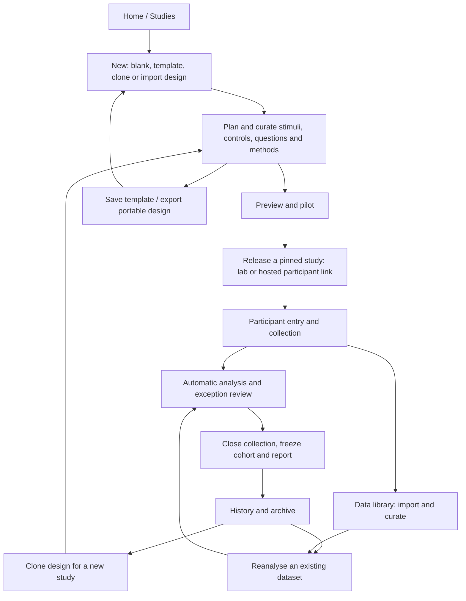

# Brohn: the complete research lifecycle

Prepared 2026-09-08 after an audit of the actual application, master architecture
and archived UX research. **The scientific scope was broad; the surrounding
research operations needed explicit contracts.** This document supplies those
contracts. It is a plan, not evidence that the new screens or services exist.
It extends [the master architecture](../MASTER-ARCHITECTURE.md) and
[unified experience](UNIFIED-EXPERIENCE.md). The five study stages remain intact.

## Connected implementation checkpoint

The connected application now uses a selected workspace outside the repository:
SQLite retains immutable study/dataset/report revisions, while object storage
retains originals and completed artifacts. Study stages are Plan, Questions,
Tasks, Collect, Review, Results and History. The earlier prototype audit below is
historical; its folder layout and five-stage wording do not describe this runtime.

The implemented import route is **complete file transfer → review filename and
destination → Import this file → background source preservation → confirm mapping
→ automatic scientific job → saved report**. Upload completion alone never chooses
a later study or origin. Pending source attempts have a separate, paginated history
and explicit cancel/retry behavior. See [asynchronous intake](../operations/ASYNC-INGESTION.md)
and the [current build log](../sprints/02-full-platform.md) for executed scope.

## Historical prototype audit: where studies and data lived

**At the preparation audit:** the prototype application folder was `data/drafts` under the repository,
currently `C:/Users/User/Documents/Codex/2026-09-05/make/outputs/research-platform/data/drafts`.
`RESEARCH_PLATFORM_DATA` can override it; the configuration of an already-running
process must be checked before assuming its actual location. The code audit did
not inspect saved participant contents. [Storage entry point](../../R/app.R).

| Current content | How it is saved | Current limitation |
|---|---|---|
| Study draft | `draft-<id>.json`, with design/session metadata and embedded PNGs | Saving updates this draft; a revision number is not a complete edit history. |
| Prepared dataset and report | Neighboring `draft-<id>.json.analyses/r<revision>-<id>.json`, including original CSV bytes and frozen design | Files are retained, but reopening selects the latest report matching the current design revision; there is no full history browser. |
| Frozen protocol | Neighboring `draft-<id>.json.protocols/<hash>.json` | Immutable snapshots exist; participant deployment is not implemented. |
| Export | Draft, report and protocol JSON downloads | A draft download does not include the neighboring history folders. It is not a complete backup or the proposed portable design package. |

A basic **Export JSON → Open a draft JSON file → Save draft** path already exists
for the current supported draft schema. It imports the bundle's existing identities
and origin/read-only rules; it is not the fresh-identity design clone specified here.

Code evidence: [draft storage](../../R/storage.R), [asset storage](../../R/assets.R),
[analysis persistence](../../R/import-ui.R), [report contents](../../R/import-report.R)
and [protocol persistence](../../R/protocol-storage.R). `data/` is Git-ignored.
Uploading the source repository to GitHub would not back up participant data.
The current launcher binds to loopback; `127.0.0.1:3838` is not a participant
website on the internet. [Launcher](../../scripts/run-local.R).

**Planned:** researchers select a visible workspace location outside the source
checkout. Default to the operating system's application-data directory, with a
folder picker and a persistent **Storage and backup** page showing actual path,
used space, pending uploads, last successful backup and last verified restore.
An illustrative layout is:

```text
<selected workspace>/
  workspace.json             identity, schema and storage profile
  catalog.sqlite             projects, study revisions, dataset index, jobs, audit
  objects/sha256/<prefix>/... raw bytes and reusable assets, addressed by content
  manifests/...              frozen dataset/run/design/analysis/report versions
  private/...                separately protected contact/enrollment linkage
  staging/...                incomplete uploads and imports; bounded, recoverable
  scratch/...                disposable job attempts; never the only saved copy
```

The local profile uses SQLite with a supervised writer and immutable files. A
shared profile uses an authenticated server with project access enforcement and
managed object storage; retain SQLite for a qualified single-host configuration,
or use a server database such as PostgreSQL for the scaled deployment profile.
Never share a live SQLite file through a consumer sync folder or between clients.
Clients use the service contract. Display the selected server/storage destination;
no cloud provider, account or transfer is silently enabled. Database/object
provider adapters and migration evidence belong to the selected release profile.

Contacts and restricted media have different access rules from aggregate reports.
A content hash identifies bytes; it grants no permission. Deduplicate only within
the permitted storage boundary and preserve independent import/source provenance.
Deleting one reference must not remove bytes still retained legitimately elsewhere.
Withdrawal/retention is a separate tracked operation with explicit consequences.

## Navigation around the existing five stages

The primary shell contains **Home, Studies, Data library, Design library**. A
workspace/project selector scopes all of them. Connections, activity/jobs,
storage, members and settings are secondary destinations. Students can begin
in a personal default project without a project-configuration wizard.

| Destination | What the researcher can do |
|---|---|
| Home | Continue the actual next action; see recent studies and actionable interrupted work; start from a sample or design. |
| Studies | Search/filter by project, tags, owner, date, measures and active/archived status; see collection status, usable/total sessions and latest report. |
| Study overview | See purpose, owner, pinned design, deployment status, cohorts, recent report and activity; continue, clone, export design or open history. |
| Data library | Find datasets independently of studies; inspect source, units, dictionary, coverage, provenance, versions and permitted uses; curate or analyse. |
| Design library | Save and reuse complete templates, stimuli, AOI definitions, question blocks/scales and method recipes with pinned versions and asset licences. |
| History | Browse exact design, deployments, sessions, datasets, review decisions and reports; compare versions, reopen a frozen result or reanalyse. |

Keep **Plan → Questions → Collect → Review → Results inside a study**. Overview
and history are hubs, not extra steps in every participant run. Collect contains
delivery setup, participants and monitoring; Results contains report history and
sharing. List/card views share actions and records. Search never exposes hidden
projects or contact information. Empty states explain the next useful action;
bulk operations show affected records and preserve undo where feasible.



## Dataset curation and historical reuse

A dataset is a first-class, versioned object, not a file-picker path. It has a
workspace/project owner, source/import identity, raw object manifest, dictionary,
units/clocks/geometry, participant/run/exposure mapping, provenance and permitted
uses. Each accepted version fixes its source membership and interpretation.
Study-specific observations and reusable reference datasets remain distinguishable.

The flow is **add files → inspect → map → resolve exceptions → accept dataset**.
Show a sample preview, mapping confidence, missing channels, duplicated files and
cross-file joins before acceptance. Never guess identities or synchronize by row
order. A corrected mapping, QC mask, AOI or cohort selection creates a new version
or analysis configuration; raw bytes remain unchanged except an explicit purge.
An uploaded duplicate can reuse bytes without losing its separate source record.

Accepting an import or sealing a run creates the dataset version and starts its
eligible processing. A study can reference permitted datasets; a dataset can feed
more than one analysis. Cross-study pooling requires an explicit cohort, compatible
methods and subject-linkage policy; the app must not guess that two aliases are
the same person. Display observational unit and avoid counting repeated sessions
as independent participants.

History exposes the original report even after design edits or engine updates.
**Reanalyse** selects an existing dataset/cohort and creates a new analysis with
the changed settings and comparison to the previous report. **Clone design**
creates a new study with no observations. **Save as template** stores reusable
instructions. **Export design / Import design** transfers the definition and
permitted assets. The [portability contract](DESIGN-PORTABILITY.md) defines those
four operations and their identifier, dependency and access rules.

## Serving a study to participants

Collect offers **Run in this lab** and **Share participant link**, with the latter
available only for a configured, tested hosted profile. A local installation can
still conduct local studies without a hosting account. Supervised LAN operation
is a distinct qualified profile, not permission to expose the researcher app.

1. Preview the actual participant flow, then run a pilot with separate origin,
   allocations and data. Show the pilot findings and unresolved required fixes.
2. Choose delivery profile, recruitment/access policy, dates/timezone, quota,
   session waves, consent/debrief and completion destination. Reuse saved settings.
3. Validate supported methods, assets, endpoints, storage capacity, consent/media
   routes and network/device requirements. Freeze a design revision and release
   manifest; staging/deployment failure must not display a working link.
4. Open the release. Present a copyable participant URL and QR code, a real
   fresh-browser check and one collection monitor. Create invitation links when
   selected. Sending invitations is a separate explicit action; generation does
   not email participants automatically.

The participant endpoint serves only the pinned runner/assets and narrow enrollment,
upload and receipt APIs. The researcher workspace, credentials, contact directory
and other participants' data are inaccessible from it. Hosted operation requires
HTTPS, authenticated researchers, scoped participant credentials, project isolation,
bounded upload handling and tested deployment/backup operations before opening.
Remote studies must use supported browser methods; a remote link does not create
access to a researcher's USB eye tracker or EEG device.

Separate public links from individually scoped invitation/wave links. Public
links cannot promise perfect duplicate prevention or participant anonymity,
especially with recorded faces/voices. Store only needed recruitment identifiers;
keep invitation/contact linkage out of analysis exports. Token expiry/revocation,
server-side authorization and enumeration/rate controls are part of the endpoint
contract. Completion redirects allow only configured destinations and approved
opaque status fields; never arbitrary URLs or raw responses.

```mermaid
flowchart LR
  Link[Lab start / participant link] --> Entry[Language, access and device check]
  Entry --> Consent[Consent, eligibility and optional media choices]
  Consent --> Reserve[Reserve quota and assignment]
  Reserve --> Setup[Calibration, instructions and practice]
  Setup --> Run[Run pinned study with durable event receipts]
  Run --> Finish[Debrief / completion or distinct exit reason]
  Finish --> Saved[Upload receipt and dataset processing]
```



Only eligible, consenting entrants reserve allocation according to a transactional
quota policy. Reservations expire or release according to explicit rules. Media
permission is requested in context, after its consent choice. A refusal follows
the template's optional/required route. Before consent, collect only the minimum
entry/security/eligibility information required by the configured procedure.
Check actual browser/device compatibility before promising execution.

Session recovery respects method boundaries: surveys may resume at an approved
checkpoint; an interrupted timed trial never silently becomes its original trial.
Follow-up waves retain authorized enrollment linkage with distinct sessions and
fresh access tokens. Shared lab stations clear the previous participant's state.
Completion, screened-out, quota-full, withdrawn, interrupted and technical-failure
endings have distinct instructions. Local buffering is shown as pending until
durable receipt; debrief and participant completion need not wait for analysis.

## State transitions, closing and preservation

Use separate state fields; do not overload one study badge with every condition.

| Record | Required distinction |
|---|---|
| Study organization | Active / archived. Archive changes organization and edit policy; it is not deletion or reopening. |
| Design | Mutable draft → validated → immutable revision. Changes create another draft; in-flight runs remain pinned. |
| Deployment | Draft → ready → open ↔ paused → closed; revoked access is terminal. Pilot/live origin is separate. |
| Collection window | Planned → collecting → closing → finalized. Finalization resolves terminal runs and late-upload policy, then freezes a cohort. |
| Session | Entry/reserved/running plus distinct terminal outcome; upload completeness and data quality are separate fields. |
| Dataset | Staged → accepted immutable version; quarantine/restriction/purge status does not rewrite its scientific history. |
| Analysis/report | Queued/running/failed/available with immutable snapshots; latest pointer is separate from earlier results. |

**Pause** prevents new starts; active runs follow the declared continue policy.
**Close recruitment** prevents enrollment and enters closing; show outstanding
sessions/uploads and their expected resolution. An emergency stop is a separate
scoped action with consequences. **Finalize** freezes cohort and report; unresolved
uploads cannot disappear silently. Late arrivals create a new dataset/cohort/report
revision under policy. Reopening creates a new collection window, preserving the
previous report. Unarchiving alone never activates a link or resumes recruitment.

## Collaboration, export, backup and retention

Define owner/admin, designer, operator, analyst and reviewer roles by permitted
actions. Check access on each API/object request, including guessed IDs and exports.
The local personal workspace can map these to its owner; hosted profiles must
exercise multiple identities. Concurrent edits retain revision preconditions and
a recoverable conflict view. Review comments attach to exact objects/revisions.

Share a frozen report snapshot with an explicit audience and revocation/expiry;
new participants must not silently change that snapshot. A downloaded file cannot
be recalled, so sharing and dataset export preview its included content. Separate
design packages, analysis/data bundles, reports and whole-workspace backups in the
menu, with a short explanation of what each contains.

Backup binds a consistent database snapshot, immutable manifests, object inventory
and hashes. Include a restore rehearsal to a new location with identity/secret
handling; show backup success and verified restore as separate evidence. Never
reactivate participant endpoints or duplicate an accepting deployment merely by
restoring a backup. Relocation validates and switches roots atomically with a
recoverable original; a cloud sync icon is not backup evidence.

Archive and restore are reversible library actions. Withdrawal and retention
purges identify affected raw files, joins, derivatives, caches, reports, shares
and backups; retain minimal tombstones without the deleted payload. Apply purge
records during restoration before serving data, and explain retained backup
expiry or restricted-access states. Never call data deleted while accessible
copies remain under Brohn's control. Keep a protected current purge ledger outside
the rollback boundary; if a restored backup cannot reconcile it, quarantine the
affected records instead of serving potentially withdrawn data. Immutable scientific
versions may become unavailable/redacted; privacy actions do not require keeping
prohibited payloads.

## Implementation ownership and evidence

BWP01 adds workspace/project/dataset/deployment/enrollment/template identities and
migrations. BWP02 owns catalog, objects, transactional access/quota and storage.
BWP03/04 own reusable designs and questionnaire semantics. BWP05 owns delivery,
participant endpoints and lifecycle. BWP06 owns dataset ingestion; BWP13 history
and reanalysis. BWP15 owns the global shell and operational commands. BWP17 owns
portable packaging, deployment profiles, controlled sharing and backup/restore.
Cross-package slices must be integrated before claiming the related journey.

The [acceptance registry](journey-acceptance.json) adds UX-J19–UX-J34 for historical
search, dataset curation, clone, templates, deployment, participant lifecycle,
closure, reanalysis, collaboration, design portability, restoration and retention.
They remain planned/unmeasured. Retain the earlier 18 scientific/accessibility
journeys. A manifest audit establishes coverage, not successful product operation.

External UX reference: Qualtrics exposes distinct distribution routes and collection
controls, and exports design separately from responses. These support the scope
comparison; Brohn's specific contracts above are design decisions.
[Collection routes](https://www.qualtrics.com/support/survey-platform/distributions-module/collecting-responses/),
[design export/import](https://www.qualtrics.com/support/survey-platform/survey-module/survey-tools/import-and-export-surveys/).
